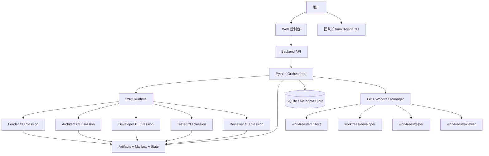

# 团队式多智能体研发编排平台（Web 控制台版）详细设计说明书

- **文档版本**：v1.8
- **编写日期**：2026-03-12
- **文档状态**：设计完成，可进入原型开发
- **目标形态**：基于 **主流 Agent CLI（Codex CLI / Claude Code / Gemini CLI 等）+ tmux + Python Orchestrator + Git worktree + Web 控制台** 的团队式多智能体研发系统

---

## 0. 阅读前名词解释

本节用于帮助第一次阅读本文档的人快速建立共同语境。  
这一节偏“阅读理解导向”，重点解释这些词在本文档中分别指什么、处在什么层级、彼此之间是什么关系。  
如果本节与后文某处的结构化配置、字段约束或协议定义存在口径差异，应以后文正式定义为准。

### 0.1 时间与范围类名词

**本轮**
指一次完整的任务执行实例，也可以理解为一次从“用户提出目标”到“系统产出结果”的运行周期。  
本轮通常会绑定一个明确的 `run_id`、一个本轮目标、一个选定的团队成员集合、一组要执行的阶段，以及一套运行策略。  
“本轮”不是永久性的团队配置，而是“这一次任务到底怎么跑”的具体落地快照。

**运行（Run）**
和“本轮”几乎是同义词，偏系统视角。  
当文档说“启动一个 run”“暂停一个 run”“恢复一个 run”时，说的是这一次任务实例的生命周期管理。  
从平台实现角度看，run 是最核心的顶层对象之一，因为它串联了阶段状态、成员会话、工件、验收、澄清问题和审计记录。

**目标（Objective）**
指本轮真正要达成的事情，例如“把某模块拆分成独立服务”, “补齐测试”, “生成详细设计”。  
目标是用户对 leader 发出的高层任务陈述，不等于代码层面的细节任务。  
目标通常比较抽象，需要由 leader 和编排器继续拆解为阶段和 job。

**阶段（Phase）**
指本轮中的一个正式工作阶段，例如需求澄清、详细设计、设计审核、任务拆分、代码开发、测试执行、最终审核。  
阶段是流程治理单元，而不是模型的一次回答。  
阶段通常有明确的负责人、参与者、输入、输出、验收规则、失败处理策略以及下一阶段。  
你可以把它理解成研发流程中的“一个正式站点”。

**轮次（Round）**
指某个阶段或某个 run 因为返工、重试、补充澄清或验收失败而再次执行时的次数。  
例如设计审核没通过，重新回到设计再审一次，这就是新一轮。  
轮次的存在是为了让系统知道：这不是一个全新的 run，而是同一目标下的第几次往返。

### 0.2 角色与协作类名词

**用户**
系统最终操作者，也是需求和决策的来源，通常是人类。  
用户不是直接管理每个成员，而是默认只面向 leader。  
用户的核心职责不是自己当调度器，而是提供目标、回答澄清问题、做高层取舍、确认高风险事项。

**团队长 / Leader**
这是系统对用户唯一可见的主入口。  
Leader 负责理解用户目标、汇总成员结果、向用户发问、向用户报告，并把用户的高层意图转译为团队可以执行的任务。  
Leader 很像真实研发团队中的 Tech Lead / PM / 组长，但它不是流程引擎，也不应独自决定状态机推进。
Leader 必须理解业务语义，否则无法完成任务拆解、问题转译和风险上报；但它不应成为设计、编码、测试、审核等专业业务结果的主产出者。  
更准确地说，Leader 是控制型角色，不是专业执行型角色；它应以调度、澄清、协调、汇总为主，而不是亲自承担专业业务阶段的主要产出责任。

**成员智能体 / Member Agent**
指开发、架构、测试、审核等各类后台执行角色。  
成员各自有职责边界、工作目录、可写路径和输出约束。  
成员不是自由聊天机器人，而是受编排器和角色规则约束的专职执行单元。

**负责人（Owner）**
指某个阶段的主责角色。  
负责人不一定独自完成该阶段全部工作，但对该阶段的正式结果和推进承担主要责任。  
例如设计阶段 owner 可能是架构师，代码阶段 owner 可能是开发工程师。

**参与者（Participants）**
指会在某个阶段中被激活、协作、提供输入或执行局部任务的角色集合。  
参与者可以只有一个，也可以是多个。  
Owner 是参与者中的主责人，但参与者强调的是“谁会在这一阶段真正介入”。

**观察**
指用户查看某个成员的实时会话镜像、状态、最近输入输出和产物，不改变系统执行。  
观察是只读行为，本质上不改变控制面。  
本架构设计允许观察直达某成员，是为了提升透明度和排障效率。

**介入**
指用户希望改变某个成员接下来做什么、优先做什么、暂停什么、补充什么约束。  
介入会改变执行上下文，因此不是只读行为。  
在本文档中，介入必须通过 leader 或 orchestrator 转发，而不能由用户直接对成员下令。

**间接介入**
这是本文档的正式机制：用户可以提出“希望某成员怎么做”，但必须先提交给 leader，再由 leader 决定是否、何时、以什么形式转发。  
这样做的目的是保证控制面不分裂，所有任务变更都还能回到 leader 的统一视角之下。

### 0.3 编排与运行时类名词

**编排器 / Orchestrator**
指负责驱动整个系统运行的 Python 后端。它管理阶段推进、成员会话生命周期、状态机、重试恢复、问题澄清、验收检查和审计记录。  
编排器是系统的流程中枢，但它本身不替代大模型做语言理解。它和 `Leader` 的区别在于：编排器负责“流程怎么走”，`Leader` 负责“任务怎么理解、怎么表达、怎么向用户解释”。换句话说，编排器是代码驱动的控制平面，偏确定性执行；`Leader` 是模型驱动的协作中枢，偏语言理解、任务拆解、结果汇总与对外沟通。  
编排器可以决定何时进入下一阶段、何时暂停等待澄清、何时触发验收或重试，但不应该自己扮演用户代表；`Leader` 可以提出问题、整合成员意见、向用户汇报和转译需求，但不应该单独充当状态机引擎。  
二者配合后的目标是：由编排器保证流程稳定、可恢复、可审计，由 `Leader` 保证需求理解、沟通质量和任务上下文不失真。

**运行时（Runtime）**
指实际承载智能体会话的执行环境。  
在本文档里，运行时主要由 `tmux + Agent CLI` 组成。  
它负责把智能体会话跑起来、保持常驻、接受输入、提供实时观察，但不负责业务流程语义。

**tmux session / window**
指每个成员实际所在的终端容器。  
它的作用是让不同成员拥有独立的长期会话，并支持 attach、detach、抓屏、重启。  
tmux 是托管容器，不是消息总线，更不是阶段状态真值来源。

**Agent CLI（Codex CLI / Claude Code / Gemini CLI 等）**
指底层运行在每个终端中的交互式编程智能体执行器。  
它负责与模型交互、读取上下文、执行工具和生成结果。  
在本文档里，平台不把某一家 CLI 工具写死为唯一后端，而是通过统一的运行时适配层支持多种主流 CLI；这些 CLI 被视为“成员的大脑”，但它们的终端输出都不会被直接当作正式协议。

**预启动脚本 / Prelaunch Hook**
指在某个 tmux session / window 启动智能体 CLI 前，先执行一组 shell 级预启动动作。  
这些动作可以是注入网络环境变量、source 某个环境脚本、导出临时变量、准备凭据、切换代理端口，或做其他轻量运行时准备。  
代理端口只是 prelaunch hook 的一个典型例子，不应被设计成唯一用途；这类配置应被视为成员运行时的一部分，允许按成员默认配置，也允许按本轮运行计划临时覆盖。

**执行拓扑（Execution Topology）**
指本轮某一时刻到底启用了怎样的团队规模和协作形态。  
例如 `solo` 表示几乎只有 leader 自己工作，`leader_worker` 表示 leader 加一个专职成员，`full_team` 表示设计、开发、测试、审核等角色一起参与。  
执行拓扑决定后台实际激活了谁，而不是用户表面上能看到多少人。

**编排原语（Orchestration Primitive）**
指编排器用来驱动系统前进的显式动作语义。  
例如 `assign`、`handoff`、`send_message`、`request_clarification`、`evaluate`、`retry`、`pause`、`resume`、`terminate`。  
原语不是实现细节，而是可审计、可 checkpoint、可 replay 的一等动作；阶段是治理单元，原语是执行单元。

**步骤（Orchestration Step）**
指某次原语执行形成的一步结构化运行记录。  
一个 step 至少应能回答：是谁在什么阶段执行了什么原语、读取了什么输入、产出了什么输出、形成了哪个 checkpoint。  
step 是 durable execution 的最小持久化粒度，不应只靠 tmux 屏幕回放来推断。

**Checkpoint**
指系统在某个稳定边界保存的一份可恢复快照。  
它通常包含当前 workflow state、active jobs、open questions、topology、最近一步 step 信息和相关结果引用。  
checkpoint 的价值不是“备份一个文件”，而是让系统可以从某个已知边界 resume、replay，必要时 fork 出新的运行分支。

**自适应编排**
指系统不会默认一上来就满编启动所有成员，而是先选择最小可行拓扑，随着复杂度、歧义、风险和验收失败情况再动态扩张或收缩。  
这是一种成本和效率优化机制。  
它的核心思想是：简单任务轻跑，复杂任务重跑，但控制面始终对用户保持单一。

**固定编排**
和自适应编排相对。  
固定编排表示本轮开始前就确定要启用哪些成员、按什么规模运行，中途不因复杂度变化自动调整拓扑。  
它适合流程可预测、治理要求强、执行模式稳定的任务。

### 0.4 配置与规划类名词

**团队配置（team.yaml）**
回答的是“有哪些成员能被系统调用”。  
它定义角色、模型、会话名、工作目录、可写路径、汇报关系、是否可观察等能力边界。  
团队配置更像一个“人员编制表”。

**阶段库配置（workflow.yaml）**
回答的是“系统有哪些可用阶段，以及每个阶段如何定义”。  
它定义阶段模板、输入输出、验收模板、失败处理、拓扑偏好、澄清策略等。  
阶段库更像一个“流程模板库”。

**技能 / 能力卡（Skill / Capability Card）**
指可复用的能力单元，而不是角色本身。  
它通常包含：一段任务指令、适用场景、可读取资源、可运行脚本、附加工具权限和输入输出约束。  
角色回答“你是谁、向谁汇报”，skill 回答“你额外会什么、在什么条件下调用什么资源”；二者不应混在同一个 prompt_file 里。

**运行计划（run.yaml）**
回答的是“这一次到底跑哪些阶段、采用什么拓扑、激活哪些成员、覆盖哪些默认策略”。  
如果说 team.yaml 是编制表，workflow.yaml 是流程模板库，那么 run.yaml 就是“这次任务的实际作战计划”。

**成员池（member_pool）**
指本轮允许被激活的成员范围。  
它不等于全部都会启动，只表示系统有权在自适应编排过程中从这个池子里选择需要的角色。  
是否真正启动某个成员，取决于 execution topology 和当前阶段需要。

**阶段偏好拓扑（preferred_topology）**
指某个阶段推荐采用的执行规模。  
例如设计审核更可能偏向 `full_team`，而简单实现更可能偏向 `leader_worker`。  
它不是强制命令，而是给 adaptive planner 的优先参考。

### 0.5 产物与通信类名词

**工件 / Artifact**
指被系统正式接纳、可落盘、可被后续阶段消费和验收的产出物。  
工件强调“产出结果”，不强调“执行动作”；因此“编程 / 编码”本身不是工件，而是产生工件的活动。  
本文档里的工件可分为两类：一类是管理与知识类工件，例如原始需求、需求澄清记录、详细设计、任务拆分、测试计划、测试报告、审核意见、最终审核结论；
另一类是实现类工件，例如源码变更、测试代码、配置变更、迁移脚本、补丁、diff、分支上的实现结果，以及与之配套的实施记录。  
工件是“正式知识”或“正式实现结果”，用于后续阶段继续消费，也用于审计、回溯、对比和验收。

**实现工件包（Implementation Bundle）**
指编程阶段交付的一组实现类工件集合。  
它通常包括代码变更、测试或脚本变更、必要的配置 / 迁移文件、变更清单以及实施记录。  
平台不把“我已经编码完成”这句话当作产出，而是把这组可检查、可运行、可验收的实现结果当作编程阶段的正式输出。

**邮箱协议 / Mailbox**
指成员之间不靠聊天窗口直接互发消息，而是通过文件化方式交换正式任务和正式回应。  
这套协议通常由 inbox 和 outbox 组成。  
它的目标是让协作过程可审计、可恢复、可重放。

**Inbox**
某个成员待处理任务的输入队列。  
它告诉成员“你现在应该做什么、用哪些输入、工作在哪个目录、最后向谁汇报”。  
成员只读自己的 inbox。

**Outbox**
某个成员完成任务后写出的正式回报。  
它会说明状态、摘要、影响文件、建议下一步等。  
系统不会把终端里的自然语言输出当作正式完成信号，而是以后者为准。

**澄清问题（Question Request）**
指成员在发现需求不完整、边界不明确、存在多种合理方案或验收标准缺失时发起的结构化提问请求。  
它不是随意聊天，而是正式阻塞信息。  
系统要求这类问题先路由给 leader，再由 leader 向用户发问。

**问题回答（Question Response）**
指用户在已经理解问题背景、冲突点和影响范围之后，针对澄清问题给出的正式最终回答、选项选择或补充约束。  
如果用户此时还看不懂问题本身，不应被迫立即回答，而应先发起反向澄清，要求 leader 或团队进一步解释。  
最终回答必须被结构化记录，并回写成需求补充或决策记录；这样系统后续不是“记住了一段聊天”，而是“得到了正式补充需求”。

**反向澄清（Ask-back）**
指用户在收到澄清问题后，发现自己还不理解其中的术语、背景、冲突点、影响范围或选项差异，因此先不直接作答，而是正式要求 leader 进一步解释问题。  
反向澄清不是跑题，也不是驳回问题，而是 HITL 闭环中的正常组成部分。  
系统应支持用户连续多轮 ask-back，直到问题被解释到用户真正理解为止；这些往返记录都应进入同一个澄清线程，而不是散落在聊天窗口里。

**需求补充说明**
指用户在运行过程中新增、澄清或补足的要求。  
它的价值是把原本只存在于问答中的信息沉淀成正式输入。  
后续设计、编码、测试都应以它为依据之一。

**决策记录**
指用户或系统在多个方案之间做出的明确取舍记录。  
例如“是否保留向后兼容”“是否接受某性能折中”“先做哪个子模块”。  
决策记录的作用是防止系统后续遗忘为什么这样做。

### 0.6 验收与推进类名词

**Gate**
指阶段是否允许继续向下一阶段推进的关口。  
Gate 不是“模型觉得差不多了”，而是“系统根据规则判定当前阶段可以过了”。  
在本文档当前版本中，gate 的判断基准已经升级为“验收通过”，不再只是“文件存在”。

**验收（Acceptance）**
指系统对阶段产出进行正式质量判断的过程。  
验收可能包括：工件是否存在、结构化 rubric 评分、命令是否执行通过、需求与设计是否建立映射、diff 是否越权、风险是否清零等。  
验收的目标是把“看起来像完成”变成“可以被系统确认的合格完成”。

**验收模板（acceptance_profile）**
指一组可复用的验收规则集合。  
某个阶段绑定某个 acceptance_profile 后，系统就知道这个阶段到底该怎么判定“合格”。  
这使得 gate 不再写死在代码里，而是配置驱动。

**验收结果（Acceptance Result）**
指验收执行之后落到文件中的结构化检查结果。  
它会说明哪些检查通过、哪些失败、下一步建议是什么。  
Gate evaluator 只应消费这种结果，而不应该直接从终端文本猜阶段是否完成。

**Evaluator / Acceptance Service**
指独立于执行成员之外的验收服务或验收角色。  
它的职责不是生成业务结果，而是对候选结果进行检查、打分、归因，并形成 evaluator result。  
在本文档的 1.x 语义里，执行者最多声明“候选结果已产出”，最终是否通过必须由 evaluator / acceptance engine 独立给出结论。

**Guardrails**
指在运行过程中用于阻断、约束或升级处理的安全与质量护栏。  
它不只是一条路径白名单，而是至少应包含 input guardrails、output guardrails、tool guardrails 和 policy tripwires。  
guardrail 命中后，系统不应继续“试试看”，而应显式进入 `block`、`ask_back`、`escalate_to_leader`、`require_approval` 等后续动作。

**通过 / 未通过**
“通过”表示当前阶段满足了继续推进的条件。  
“未通过”并不一定等于系统崩了，它也可能只是说明某个检查失败，需要重试、返工、补充澄清或升级拓扑。

### 0.7 人类在环与自动化类名词

**人类在环（HITL）**
在本文档中，人类在环的首要含义不是“批准某个操作”，而是“当 AI 遇到歧义、缺失、取舍冲突时，能够向人提问并获得正式回答”。  
只有少数高风险动作，HITL 才承担审批功能。  
所以这里的人类在环更接近“需求澄清闸门”和“歧义消解闸门”。  
这个闸门是双向的：AI 可以向人提问，人也可以向 leader 反问，要求系统先把问题解释清楚，再继续收集正式答复。

**混合模式（Hybrid）**
表示系统默认自动推进，但遇到预设触发条件时会暂停，等待用户提供答案、约束或取舍。  
它适合大多数真实研发场景，因为许多任务大部分时间可以自动跑，只有少数点需要人工拍板。  
Hybrid 是“自动优先，但保留正式澄清入口”。

**无人值守（Unattended）**
表示某阶段在约束已经足够清晰的前提下可以不等人、直接自动跑完。  
它适合只读扫描、初稿生成、低风险且边界清晰的执行任务。  
无人值守不是“绝对不需要人”，而是“本阶段当前不需要人”。

**暂停（Pause）**
表示 run 在某个位置被系统主动停住。  
暂停常见原因包括：遇到澄清问题、验收失败、成员卡死、用户手动中断等。  
暂停不是失败，而是运行状态的一种。

**恢复（Resume）**
表示暂停原因已被处理后，系统继续从原来的上下文往下执行。  
好的恢复机制要求状态可追踪、问题有记录、工件已回写、不会因为恢复而丢上下文。

### 0.8 代码与隔离类名词

**Git worktree**
指同一 Git 仓库的多个独立工作目录。  
在本文档里，任何可能改动 `src/`、`tests/` 等代码路径的成员都应在自己的 worktree 内工作。  
这样可以避免多个成员同时改同一个工作目录造成相互污染。

**污染**
指某个成员把未完成、中间态、越权或不该出现的改动带进了别人的执行上下文或主目录。  
污染不一定是恶意操作，更常见的是并行协作时天然产生的状态混乱。  
Worktree 隔离和路径白名单就是为了解决这个问题。

**路径白名单（writable_paths）**
指某个成员被允许修改的目录或文件范围。  
它是权限模型的一部分，用来限制角色边界。  
即使模型主观上“知道自己不该改”，平台仍然需要这类机制做硬约束。

### 0.9 为什么这一节重要

这份文档既讨论“产品界面怎么设计”，也讨论“后端编排怎么实现”，还讨论“成员之间如何通信、如何验收、如何暂停恢复”。  
同一个词在不同上下文里很容易被误解，例如“阶段”不是“会话轮次”，“本轮”不是“整个团队永久配置”，“人类在环”不是“只有审批”，“无人值守”也不是“永远不需要人”。  
先把这些名词读清楚，后面看配置、状态机、API 和运行流程时就不容易混淆。

---

## 1. 文档摘要

本文档给出一套完整的、可落地的系统设计方案，用于实现如下目标：

1. 用户只需要和 **团队长智能体（Leader）** 对话。
2. 团队长负责理解任务、拆解任务、调度团队成员智能体。
3. 团队成员智能体可以包括但不限于：开发工程师、架构师、测试工程师、审核员、文档工程师、发布经理等。
4. 每个智能体运行在自己的 **tmux session / window** 中，底层由 **主流 Agent CLI backend** 驱动。
5. 智能体之间通过 **文件邮箱（mailbox）** 与正式工件（artifacts）进行通信。
6. 团队成员默认**只向团队长汇报**；团队长再统一对用户汇报或发出问询。
7. 用户可以随时观察某个成员智能体；如需介入，该介入必须通过团队长执行，确保控制面不分裂。
8. 用户可配置：
   - 本轮有哪些团队成员
   - 每个成员使用哪种 Agent CLI backend
   - 每个成员是否启用代理 / 使用哪个代理端口
   - 本轮执行哪些阶段
   - 本轮采用固定编排还是自适应编排
   - 每个阶段的输入、输出、负责人、参与者
   - 哪些阶段必须进入人类在环的需求澄清 / 歧义消解闸门
   - 哪些阶段可以无人值守（unattended）
9. 代码阶段采用 **Git worktree** 隔离，避免多个智能体并行改动同一工作目录造成冲突。

本文档不仅描述后端运行时设计，也给出 **网站/控制台** 的信息架构、页面设计、数据模型、API 设计、异常恢复与 MVP 路线图。

---

## 2. 背景与问题定义

### 2.1 当前单智能体或手工多智能体工作流的问题

典型问题包括：

- 用户需要同时盯多个终端或多个会话。
- 开发、测试、审核之间的结果传递依赖人工复制粘贴。
- 阶段、角色、产物往往写死在脚本里，扩展性差。
- 多个智能体同时改代码时容易互相覆盖。
- 人类难以只盯一个总入口获得完整进度。
- 一旦某个智能体卡死或跑偏，很难统一管理与恢复。

### 2.2 目标问题

我们希望把“多个主流 Agent CLI 智能体 + tmux + Python 编排”组织成一个类似真实研发团队的系统：

- 用户像和“团队长”对话一样对整个团队发号施令；
- 团队长像 PM / Tech Lead 一样分派任务、汇总进度、回报结果；
- 团队成员在后台持续工作；
- Web 控制台提供统一可视化；
- tmux 提供底层会话托管和随时接管能力；
- 文件协议提供可审计、可恢复、可重放的通信机制。

---

## 3. 设计目标与非目标

## 3.1 设计目标

### G1. 单一控制面
用户默认只看团队长，不必逐个检查成员智能体。

### G2. 多智能体协作
多个成员可以并行工作，但必须在统一的流程与权限约束下协作。

### G2.1 自适应编排
系统应能根据任务复杂度、风险、歧义数量、并行需求和验收结果，在最小可行拓扑与完整团队拓扑之间自适应升降，而不是默认每轮满编启动。

### G3. 配置驱动
团队成员、阶段、产物、skills、guardrails、人类澄清闸门、无人值守策略都通过配置驱动，而不是写死在 Python 逻辑里。

### G3.1 多 CLI 与会话级网络配置兼容
平台不应只绑定单一 Agent CLI；应允许不同成员使用不同 CLI backend，并支持在 tmux session 启动前按成员或按本轮注入代理端口与环境变量。

### G4. 可观察、可介入、可恢复
每个智能体都有独立 tmux 会话；系统支持实时观察、经 leader 的间接介入、暂停、恢复、重试。

### G5. 代码阶段隔离
任何会修改代码的成员，必须在隔离的 worktree 中工作。

### G6. 文件化协议
正式结果必须写入 artifacts 或 outbox，不依赖终端抓屏作为正式协议。

### G7. 适配网页化
系统不仅是命令行脚本，还要能映射到一个可用的 Web 控制台产品。

## 3.2 非目标

### NG1. 不追求自由聊天式 swarm
v1 不允许成员自由互相发消息，不做“完全自治群聊”。

### NG2. 不追求云原生分布式调度
v1 默认部署在单机（如 Mac mini）或单台 Linux 服务器上。

### NG3. 不追求全自动生产发布
涉及高风险动作的阶段默认仍应有人类确认，但这不是 v1 中人类在环的首要职责。

---

## 4. 核心原则

### P1. tmux 只是运行时，不是消息总线
tmux 负责：
- 启动 Agent CLI 会话
- 保持会话常驻
- 发送输入
- 抓取输出
- 提供 attach / detach

tmux 不负责：
- 流程编排
- 业务协议
- 状态判断
- 成员间关系治理

### P2. 正式结果必须落文件
正式结果只认可：

- `runtime/outbox/*.json`
- `runtime/evaluations/*.json`
- `artifacts/*.md`
- `runtime/state/*.json`

`capture-pane` 只用于观察、日志、调试、卡死检测。

### P3. 团队成员默认只向团队长汇报
这是整个系统控制面不分裂的核心规则。

### P4. 角色、阶段、产物、skills、guardrails、模式全部配置化
系统运行时只解释配置，不把具体团队形态、能力装配和流程规则写死在代码里。

### P5. 阶段推进由状态机决定，不由大模型“猜下一步”
Leader 智能体负责语言理解与任务汇总；流程推进由 Python runtime 和 workflow state 决定。

### P6. 代码修改必须 worktree 隔离
任何会改 `src/`、`tests/` 的成员都必须绑定 worktree。

### P7. 人类在环是正式运行机制，不是临时插嘴
HITL 首要用于需求澄清与歧义消解，而不是单纯审批操作；系统必须具备可暂停、可恢复、可审计、可回写工件的机制。

### P8. 编排应先小后大、自适应升降
系统默认从最小可行执行拓扑启动，只有在复杂度、歧义、风险或验收失败表明需要更多角色参与时才扩张；当问题收敛后，应允许收缩回更轻的拓扑。

### P9. Gate 以验收通过为准，不以文件存在为准
工件落盘只是候选结果，不是阶段完成。阶段只有在相关验收检查通过后才可过 gate。

### P10. 调度动作必须显式化为编排原语
`assign`、`handoff`、`request_clarification`、`evaluate`、`retry` 等动作必须成为结构化一等语义，而不是散落在代码里的隐式 inbox/outbox 操作。

### P11. Durable execution 必须以步骤和 checkpoint 为粒度
`workflow.json`、`jobs.jsonl`、`pause_request.json` 只是基础；1.x 还应支持步骤级 step log、checkpoint、resume、replay、fork，且副作用边界必须可识别。

### P12. Guardrails 必须分层并具备阻断能力
路径白名单只是 tool guardrails 的一部分。  
输入、输出、工具调用和策略 tripwire 都应能在运行中阻断或升级，而不是只做事后提醒。

### P13. Prompt 与 Skill 必须分离
`prompt_file` 负责角色身份、汇报关系和通用规则；可复用能力、资源、脚本和附加工具策略应通过 skill registry 管理。

### P14. 执行与验收必须分离
执行成员只负责产出 candidate result；通过与否必须由独立 evaluator / acceptance engine 给出，leader 最终只汇总 evaluator 结果。

### P15. Leader 以控制职责为主，不承担专业业务阶段的主产出责任
Leader 可以理解业务、拆解任务、解释冲突、汇总结果，但不应默认充当架构师、开发、测试或审核员。  
除澄清、任务拆分、计划同步、集成协调、最终汇报等控制型阶段外，专业业务阶段应优先由对应专业角色担任 owner。

---

## 5. 术语定义

| 术语 | 定义 |
|---|---|
| 用户 | 系统最终操作者，只和团队长对话 |
| 团队长（Leader） | 对用户唯一可见的智能体，会分派任务并汇总结果 |
| 成员智能体（Member Agent） | 团队中的执行角色，如开发、测试、审核等 |
| Orchestrator | Python 编排器，控制流程状态、任务投递、会话生命周期 |
| tmux session | 每个智能体的终端会话容器 |
| Artifact | 正式工件，如详细设计、测试计划、审核意见 |
| Inbox | 某个成员待处理任务队列 |
| Outbox | 某个成员最近一次正式回报 |
| Execution Topology | 执行拓扑，如 `solo`、`leader_worker`、`full_team` |
| Acceptance Check | 对阶段产出进行验收的结构化检查，如 rubric 评分、命令执行、traceability、风险项清零 |
| Workflow State | 流程状态机快照 |
| HITL | Human-in-the-loop，人类在环；默认用于需求澄清、歧义消解、方案选择，必要时才用于高风险审批 |
| Hybrid | 默认自动跑，但某些条件触发暂停等待人类回答、选择或补充约束 |
| Unattended | 无人值守自动推进 |
| Worktree | Git 的独立工作目录，用于多智能体隔离开发 |

---

## 6. 角色与职责模型

### 6.1 用户
职责：
- 给团队长下达高层目标
- 回答澄清问题并补充隐含需求
- 当问题本身不易理解时，要求 leader 进一步解释问题背景、冲突点、影响范围与方案差异
- 在多种合理方案之间做选择
- 必要时确认高风险动作
- 必要时请求 leader 间接干预某成员

规则：
- 默认只看团队长界面
- 可直接观察成员会话镜像
- 如需介入成员，必须通过 leader

### 6.2 团队长（Leader）
职责：
- 接收用户目标
- 理解与拆解任务
- 汇总成员结果
- 向用户汇报
- 汇总待澄清问题并向用户提问
- 将技术性问题转译为用户可理解的语言，并在用户反问时组织团队补充解释
- 将问答回写为需求补充与决策记录
- 触发阶段间过渡建议

规则：
- 必须理解业务目标与关键约束，但主要职责是调度、沟通、澄清与汇总，而不是直接产出专业业务结果
- 默认不直接修改业务代码
- 默认不承担详细设计、编码实现、测试执行、专业审核等阶段的主产出责任
- 在需求澄清、任务拆分、计划同步、集成协调、最终汇报等控制型阶段，可以由 leader 担任 owner
- 主要写 `runtime/state/`、`runtime/inbox/`、`artifacts/` 中的管理性文件

### 6.3 架构师（Architect）
职责：
- 产出详细设计
- 修订设计
- 分析模块边界、接口、部署、依赖、回滚

规则：
- 主要写设计文档
- 默认不直接写主业务代码

### 6.4 开发工程师（Developer）
职责：
- 根据任务拆分实现代码
- 产出实现工件包（代码、测试、配置 / 迁移、变更清单、实施记录）
- 修复测试失败
- 修复审核问题
- 更新实施记录

规则：
- 默认只在自己的 worktree 工作
- 允许修改 `src/`、必要的 `tests/`
- 需要把实现结果整理为可验收的实现工件包，而不是只回一句“已完成编码”

### 6.5 测试工程师（Tester）
职责：
- 产出测试计划
- 编写与修复测试
- 执行测试
- 输出测试报告

规则：
- 优先修改 `tests/`
- 原则上不改业务代码，除非明确授权

### 6.6 审核员（Reviewer）
职责：
- 审核设计
- 审核代码
- 输出修改意见

规则：
- 默认只读
- 正式输出为审核意见文档与结构化 outbox

### 6.7 其他可选成员
用户可以自定义扩展角色：

- 文档工程师
- 发布经理
- 安全审计员
- 性能优化工程师
- 数据工程师
- 量化研究员
- API 设计师
- DevOps 工程师

---

## 7. 总体架构设计



### 7.1 分层说明

#### 前端层（Web Console）
提供：
- 团队管理
- 流程配置
- 运行计划配置
- 实时执行监控
- tmux 会话观察入口
- 澄清问题回答界面
- 工件浏览与 diff

#### 应用层（Backend API）
提供：
- REST API
- WebSocket/SSE 实时推送
- 认证鉴权
- 配置加载
- 运行计划管理

#### 编排层（Python Orchestrator）
提供：
- 启停 tmux session
- 启动指定 Agent CLI backend
- 选择或调整执行拓扑
- 分派任务
- 状态机推进
- 重试/恢复/回滚
- 阶段 gate 检查
- 触发验收评估

#### 运行层（tmux + Agent CLI）
提供：
- 每个成员的独立交互式 AI 会话
- 人工 attach 与实时观察
- 持久 session
- 启动前环境注入（如代理端口、session env）

#### 存储层（Filesystem + SQLite）
提供：
- 工件存储
- inbox/outbox
- step / checkpoint
- 验收结果
- guardrail 结果
- skills registry
- workflow 状态
- 审计日志
- 运行索引

---

## 8. 配置驱动模型

系统核心由三类主配置文件驱动，并可挂接本地 skills / guardrail registry：

1. `team.yaml`：定义“本轮谁能干活”
2. `workflow.yaml`：定义“有哪些可用阶段”
3. `run.yaml`：定义“本轮到底启用谁、跑哪些阶段、如何跑”

---

## 9. 团队配置（team.yaml）

## 9.1 设计目标
用户应能自由指定：

- 有哪些成员
- 每个成员使用哪种 Agent CLI backend
- 每个成员的模型 / profile
- 平台是否为该 backend 使用内置命令模板，还是手工覆盖启动命令
- 每个成员的权限模式
- 每个成员的工作路径 / worktree
- 每个成员的可写目录
- 每个成员的启动前环境变量、预启动脚本与代理端口
- 每个成员默认加载哪些 skills
- 每个成员默认绑定哪套 guardrail profile
- 每个成员向谁汇报
- 每个成员是否允许被用户观察
- 每个成员是否允许接收 leader 转发的用户介入请求

## 9.2 推荐配置结构

```yaml
team:
  leader:
    runtime_backend: codex
    runtime_command: auto
    title: 团队长
    model: gpt-5.4
    approval_mode: suggest
    session_name: team-leader
    worktree: worktrees/leader
    reports_to: user
    allow_user_observe: true
    can_receive_direct_user_instruction: true
    proxy:
      enabled: false
    session_env:
      TEAM_MEMBER_ID: leader
    prelaunch_hooks: []
    default_skills:
      - task_decomposition
      - clarification_translation
    guardrail_profile: leader_standard
    writable_paths:
      - artifacts/
      - runtime/state/
      - runtime/inbox/
      - runtime/outbox/
    prompt_file: prompts/leader.md

  architect_main:
    runtime_backend: claude_code
    runtime_command: auto
    title: 架构师
    model: claude-sonnet-4-6
    approval_mode: auto-edit
    session_name: team-architect
    worktree: worktrees/architect
    reports_to: leader
    allow_user_observe: true
    can_receive_direct_user_instruction: false
    can_receive_leader_forwarded_user_instruction: true
    proxy:
      enabled: false
    prelaunch_hooks: []
    default_skills:
      - architecture_design
      - interface_boundary_review
    guardrail_profile: design_readwrite_safe
    writable_paths:
      - artifacts/
    prompt_file: prompts/architect.md

  developer_backend:
    runtime_backend: codex
    runtime_command: auto
    title: 后端开发工程师
    model: gpt-5.4
    approval_mode: auto-edit
    session_name: team-dev-backend
    worktree: worktrees/developer_backend
    reports_to: leader
    allow_user_observe: true
    can_receive_direct_user_instruction: false
    can_receive_leader_forwarded_user_instruction: true
    proxy:
      enabled: true
      host: 127.0.0.1
      port: 7890
      http_scheme: http
      socks_scheme: socks5
    prelaunch_hooks:
      - inline: |
          export https_proxy=http://127.0.0.1:7890
          export http_proxy=http://127.0.0.1:7890
          export all_proxy=socks5://127.0.0.1:7890
    default_skills:
      - implementation_bundle
      - backward_compatibility_patch
    guardrail_profile: strict_code_editor
    writable_paths:
      - src/
      - tests/
      - artifacts/实施记录.md
    prompt_file: prompts/developer_backend.md

  tester_regression:
    runtime_backend: gemini_cli
    runtime_command: auto
    title: 测试工程师
    model: gemini-2.5-pro
    approval_mode: auto-edit
    session_name: team-tester
    worktree: worktrees/tester
    reports_to: leader
    allow_user_observe: true
    can_receive_direct_user_instruction: false
    can_receive_leader_forwarded_user_instruction: true
    proxy:
      enabled: false
    prelaunch_hooks: []
    default_skills:
      - regression_validation
      - test_plan_generation
    guardrail_profile: test_editor_restricted
    writable_paths:
      - tests/
      - artifacts/测试计划.md
      - artifacts/测试报告.md
    prompt_file: prompts/tester.md

  reviewer_api:
    runtime_backend: opencode
    runtime_command: auto
    title: 审核员
    model: anthropic/claude-sonnet-4-5
    approval_mode: suggest
    session_name: team-reviewer
    worktree: worktrees/reviewer
    reports_to: leader
    allow_user_observe: true
    can_receive_direct_user_instruction: false
    can_receive_leader_forwarded_user_instruction: true
    proxy:
      enabled: false
    prelaunch_hooks: []
    default_skills:
      - code_review_rubric
      - release_readiness_review
    guardrail_profile: reviewer_readonly_strict
    writable_paths:
      - artifacts/审核意见.md
    prompt_file: prompts/reviewer.md
```

## 9.3 字段说明

| 字段 | 说明 |
|---|---|
| `runtime_backend` | 运行该成员所使用的 CLI backend，例如 `codex`、`claude_code`、`gemini_cli`、`opencode`、`custom` |
| `runtime_command` | 该 backend 的启动命令；`auto` 表示直接使用平台内置的 backend 命令模板与参数拼装逻辑 |
| `title` | 成员显示名称 |
| `model` | 当前 backend 需要的模型 / profile / preset；必须允许按成员单独指定，而不是全局只有一个默认模型 |
| `approval_mode` | 平台抽象的执行模式；由 runtime adapter 映射为各 CLI 的具体启动参数或行为约束 |
| `session_name` | tmux session/window 名称 |
| `worktree` | 成员绑定的工作目录 |
| `reports_to` | 向谁汇报，通常是 `leader` |
| `allow_user_observe` | 是否允许用户直接观察该成员会话镜像 |
| `can_receive_direct_user_instruction` | 是否允许用户直接下令；除 `leader` 外建议为 `false` |
| `can_receive_leader_forwarded_user_instruction` | 是否允许接收 leader 转发的用户介入请求 |
| `proxy` | 会话级代理配置；启动 CLI 前由 orchestrator 自动注入 `http_proxy` / `https_proxy` / `all_proxy` |
| `session_env` | 该成员 session 的额外环境变量，用于通用运行时配置 |
| `prelaunch_hooks` | 在启动 CLI 前执行的预启动 shell 动作；可用于 `export` 变量、`source` 环境脚本、准备凭据、切换代理等 |
| `default_skills` | 该成员默认加载的技能 / 能力卡列表；运行时可按 phase 或 run 追加、禁用或覆盖 |
| `guardrail_profile` | 该成员默认使用的护栏策略配置 ID |
| `writable_paths` | 允许修改的路径白名单 |
| `prompt_file` | 角色初始化 prompt 文件 |

## 9.4 示例角色绑定
平台应允许像下面这样按成员绑定不同 backend 与模型：

- leader：`codex + gpt-5.4`
- architect：`claude_code + claude-sonnet-4-6`
- developer：`codex + gpt-5.4`
- tester：`gemini_cli + gemini-2.5-pro`
- reviewer：`opencode + anthropic/claude-sonnet-4-5`

重点不是把团队锁死在某一家 CLI，而是让用户只声明“谁用什么 backend、跑什么模型”，由平台自动选用内置命令模板生成最终启动命令。  
如果用户要把测试角色改成未来的 `gemini-3.0-*` 模型，或把 reviewer 改成别的 provider / model，只需要改 `model` 字段，不需要自己手写整条 CLI 命令。

## 9.5 轻量 Skills Registry（1.x）
1.x 版本建议把 `prompt_file` 和 `skill` 分离，但 skill 先做轻量注册表，不做 marketplace。

推荐目录：

```text
skills/
├── task_decomposition/
│   ├── SKILL.md
│   ├── policy.yaml
│   └── resources/
├── implementation_bundle/
│   ├── SKILL.md
│   ├── scripts/
│   └── policy.yaml
└── code_review_rubric/
    ├── SKILL.md
    └── resources/
```

1.x skill 的最小职责：

- 定义能力用途与触发条件
- 提供可复用的指令片段
- 声明可选资源 / 脚本 / rubric
- 声明附加工具限制或额外允许项
- 由 orchestrator 在运行时解析并注入到对应成员上下文

边界要求：

- `prompt_file` 不再承载全部可复用能力
- 成员可以有默认 skills，phase 也可以声明 `required_skills`
- 1.x 先支持本地 Markdown + policy 形式，不做云同步、市场分发或自动化编排生态

---

## 10. 阶段库配置（workflow.yaml）

## 10.1 设计目标
系统应该允许用户定义任意阶段，而不把流程写死为：

- 需求澄清
- 设计
- 开发
- 测试

每个阶段都应显式定义：

- 负责人
- 参与者
- 输入
- 输出
- 允许使用哪些编排原语
- 需要哪些 skills
- 绑定哪套 guardrail profile
- 由谁负责独立验收
- 验收条件
- 失败处理策略
- 是否启用需求澄清闸门 / 无人值守模式

## 10.2 推荐结构

```yaml
workflow:
  acceptance_profiles:
    clarification_acceptance:
      pass_policy: all_required
      checks:
        - type: artifact_exists
          target: artifacts/需求澄清记录.md
        - type: artifact_exists
          target: artifacts/需求补充说明.md
        - type: questions_resolved
          max_open_questions: 0
        - type: rubric_review
          target: artifacts/需求澄清记录.md
          rubric: requirements_clarity
          pass_score: 0.90

    design_acceptance:
      pass_policy: all_required
      checks:
        - type: artifact_exists
          target: artifacts/详细设计.md
        - type: rubric_review
          target: artifacts/详细设计.md
          rubric: design_completeness
          pass_score: 0.85
        - type: traceability_coverage
          source_artifacts:
            - artifacts/原始需求.md
            - artifacts/需求澄清记录.md
          target: artifacts/详细设计.md
          min_coverage: 1.0

    design_review_acceptance:
      pass_policy: all_required
      checks:
        - type: artifact_exists
          target: artifacts/审核意见.md
        - type: artifact_exists
          target: artifacts/测试计划.md
        - type: rubric_review
          target: artifacts/审核意见.md
          rubric: review_actionability
          pass_score: 0.85
        - type: unresolved_questions_count
          max: 0

    task_split_acceptance:
      pass_policy: all_required
      checks:
        - type: artifact_exists
          target: artifacts/任务拆分.md
        - type: rubric_review
          target: artifacts/任务拆分.md
          rubric: task_decomposition
          pass_score: 0.85
        - type: task_size_limit
          target: artifacts/任务拆分.md
          max_story_points: 5

    coding_acceptance:
      pass_policy: all_required
      checks:
        - type: outbox_result
          member: developer_backend
          expected_status: candidate_done
        - type: command_passes
          cwd: worktrees/developer_backend
          command: pytest tests/smoke -q
        - type: diff_within_paths
          allowed_paths:
            - src/
            - tests/
            - artifacts/实施记录.md
            - artifacts/实现工件清单.md
        - type: artifact_exists
          target: artifacts/实施记录.md
        - type: artifact_exists
          target: artifacts/实现工件清单.md

    testing_acceptance:
      pass_policy: all_required
      checks:
        - type: artifact_exists
          target: artifacts/测试报告.md
        - type: command_passes
          cwd: worktrees/tester
          command: pytest -q
        - type: rubric_review
          target: artifacts/测试报告.md
          rubric: test_report_completeness
          pass_score: 0.85

    final_review_acceptance:
      pass_policy: all_required
      checks:
        - type: artifact_exists
          target: artifacts/最终审核结论.md
        - type: rubric_review
          target: artifacts/最终审核结论.md
          rubric: release_readiness
          pass_score: 0.90
        - type: unresolved_risks
          max_high_risk: 0
        - type: user_confirmation
          when: high_risk_changes_present

  phases:

    - id: clarification
      name: 需求澄清
      enabled: true
      owner: leader
      participants: [architect_main]
      preferred_topology: leader_worker
      inputs:
        - artifacts/原始需求.md
      outputs:
        - artifacts/需求澄清记录.md
        - artifacts/需求补充说明.md
        - artifacts/决策记录.md
      mode: hitl
      human_in_the_loop:
        purpose: clarification
        policy: required
        interrupt_points:
          - on_missing_requirements
          - on_ambiguity_detected
        writeback_artifacts:
          - artifacts/需求补充说明.md
          - artifacts/决策记录.md
      unattended: false
      acceptance_profile: clarification_acceptance
      done_when:
        acceptance_passed:
          - clarification_acceptance
      on_fail: pause
      next: design

    - id: design
      name: 详细设计
      enabled: true
      owner: architect_main
      participants: [architect_main]
      preferred_topology: leader_worker
      inputs:
        - artifacts/原始需求.md
        - artifacts/需求澄清记录.md
      outputs:
        - artifacts/详细设计.md
      mode: unattended
      human_in_the_loop:
        policy: none
      unattended: true
      acceptance_profile: design_acceptance
      done_when:
        acceptance_passed:
          - design_acceptance
      on_fail: retry
      next: design_review

    - id: design_review
      name: 设计审核
      enabled: true
      owner: leader
      participants: [reviewer_api, tester_regression]
      preferred_topology: full_team
      inputs:
        - artifacts/详细设计.md
      outputs:
        - artifacts/审核意见.md
        - artifacts/测试计划.md
        - artifacts/开放问题清单.md
      mode: hybrid
      human_in_the_loop:
        purpose: ambiguity_resolution
        policy: optional
        interrupt_points:
          - on_multi_solution_conflict
          - on_acceptance_criteria_missing
        writeback_artifacts:
          - artifacts/需求补充说明.md
          - artifacts/决策记录.md
      unattended: false
      acceptance_profile: design_review_acceptance
      done_when:
        acceptance_passed:
          - design_review_acceptance
      on_fail: route_to_revision
      next: task_split

    - id: task_split
      name: 任务拆分
      enabled: true
      owner: leader
      participants: [architect_main, developer_backend]
      preferred_topology: leader_worker
      inputs:
        - artifacts/详细设计.md
        - artifacts/审核意见.md
      outputs:
        - artifacts/任务拆分.md
      mode: hybrid
      human_in_the_loop:
        purpose: ambiguity_resolution
        policy: optional
        interrupt_points:
          - on_scope_boundary_unclear
        writeback_artifacts:
          - artifacts/决策记录.md
      unattended: false
      acceptance_profile: task_split_acceptance
      done_when:
        acceptance_passed:
          - task_split_acceptance
      on_fail: pause
      next: coding

    - id: coding
      name: 代码开发
      enabled: true
      owner: developer_backend
      participants: [developer_backend]
      preferred_topology: leader_worker
      inputs:
        - artifacts/详细设计.md
        - artifacts/任务拆分.md
      outputs:
        - artifacts/实施记录.md
        - artifacts/实现工件清单.md
      mode: hybrid
      human_in_the_loop:
        purpose: ambiguity_resolution
        policy: optional
        interrupt_points:
          - on_interface_contract_unclear
          - on_backward_compatibility_unclear
          - on_risky_file_change
        writeback_artifacts:
          - artifacts/需求补充说明.md
          - artifacts/决策记录.md
      unattended: false
      acceptance_profile: coding_acceptance
      done_when:
        acceptance_passed:
          - coding_acceptance
      on_fail: pause
      next: testing

    - id: testing
      name: 测试执行
      enabled: true
      owner: tester_regression
      participants: [tester_regression]
      preferred_topology: leader_worker
      inputs:
        - artifacts/测试计划.md
      outputs:
        - artifacts/测试报告.md
      mode: hybrid
      human_in_the_loop:
        purpose: ambiguity_resolution
        policy: optional
        interrupt_points:
          - on_test_failure
          - on_expected_behavior_unclear
        writeback_artifacts:
          - artifacts/决策记录.md
      unattended: false
      acceptance_profile: testing_acceptance
      done_when:
        acceptance_passed:
          - testing_acceptance
      on_fail: escalate_to_leader
      next: final_review

    - id: final_review
      name: 最终审核
      enabled: true
      owner: reviewer_api
      participants: [reviewer_api]
      preferred_topology: leader_worker
      inputs:
        - artifacts/审核意见.md
        - artifacts/测试报告.md
      outputs:
        - artifacts/最终审核结论.md
      mode: hitl
      human_in_the_loop:
        purpose: ambiguity_resolution
        policy: required
        interrupt_points:
          - before_phase_start
          - before_phase_complete
          - on_release_decision_unclear
        writeback_artifacts:
          - artifacts/决策记录.md
      unattended: false
      acceptance_profile: final_review_acceptance
      done_when:
        acceptance_passed:
          - final_review_acceptance
      on_fail: pause
      next: done
```

## 10.3 新增关键字段

| 字段 | 说明 |
|---|---|
| `acceptance_profiles` | 可复用的验收模板库，供多个 phase 引用 |
| `acceptance_profile` | 当前 phase 绑定的验收模板 ID |
| `preferred_topology` | 当前 phase 推荐使用的执行拓扑，供 adaptive planner 参考 |
| `done_when.acceptance_passed` | 只有指定验收模板通过，phase 才能完成 |

## 10.4 1.x 增强字段建议
对于 1.x 版本，建议把以下字段纳入 phase 定义，但先保持轻量：

```yaml
workflow:
  primitive_library:
    - assign
    - handoff
    - send_message
    - request_clarification
    - evaluate
    - integrate
    - retry
    - pause
    - resume
    - terminate

  guardrail_profiles:
    strict_code_editor:
      input_guardrails:
        - prompt_injection_detection
        - unsupported_scope_detection
      output_guardrails:
        - schema_validation
        - secret_redaction
      tool_guardrails:
        - command_allowlist
        - path_boundary_check
        - network_domain_allowlist
      tripwire_policy:
        on_block: escalate_to_leader

  phases:
    - id: coding
      allowed_primitives:
        - assign
        - request_clarification
        - evaluate
        - retry
      required_skills:
        - implementation_bundle
      guardrail_profile: strict_code_editor
      evaluator: acceptance_engine
```

推荐语义：

- `allowed_primitives`
  限定当前 phase 允许使用哪些显式调度动作
- `required_skills`
  指明此 phase 附加需要的能力卡，而不是把能力硬写进角色 prompt
- `guardrail_profile`
  声明当前 phase 使用哪套护栏策略
- `evaluator`
  显式说明当前 phase 由谁做独立验收；1.x 默认是 `acceptance_engine`

补充约束：

- 每个 phase 应只有一个 `owner`
- `owner` 可以是 `leader`，但通常只适用于需求澄清、任务拆分、计划同步、集成协调、最终汇报等控制型阶段
- 设计、开发、测试、审核等专业执行阶段应优先由对应专业角色担任 `owner`
- `leader` 在专业执行阶段可以参与协调与汇总，但不应默认兼任主业务产出者

---

## 11. 运行计划配置（run.yaml）

## 11.1 设计目标
`workflow.yaml` 定义的是阶段库，真正“本轮要跑什么”由 `run.yaml` 决定。

用户应能在运行计划中指定：

- 本轮使用哪些成员
- 本轮执行哪些阶段
- 本轮采用固定编排还是自适应编排
- 某个阶段是否覆盖默认策略
- 某个阶段是否改为澄清闸门、混合模式或 unattended
- 某个阶段的参与者是否临时变化
- 是否允许用户观察哪些成员，以及通过 leader 间接介入哪些成员
- 某个成员本轮临时改用哪种 CLI backend、模型 / profile、代理端口或预启动脚本
- 本轮采用什么 checkpoint 策略
- 本轮是否附加或禁用某些 skills / guardrails

## 11.2 推荐结构

```yaml
run:
  run_id: calc-service-split-20260312
  objective: Calculation 计算层服务独立化改造

  member_pool:
    - leader
    - architect_main
    - developer_backend
    - tester_regression
    - reviewer_api

  execution_topology:
    mode: adaptive
    default: leader_worker
    allowed_topologies:
      - solo
      - leader_worker
      - full_team
    selection_signals:
      - task_complexity
      - changed_module_count
      - ambiguity_count
      - risk_level
      - acceptance_failures
    escalation_policy:
      solo_to_leader_worker:
        when:
          - phase_owner != leader
          - ambiguity_count >= 1
          - changed_module_count >= 2
      leader_worker_to_full_team:
        when:
          - parallel_roles_needed
          - acceptance_failures >= 1
          - risk_level == high
    deescalation_policy:
      full_team_to_leader_worker:
        when:
          - active_parallel_jobs <= 1
          - open_questions == 0
      leader_worker_to_solo:
        when:
          - only_leader_tasks_remaining
          - acceptance_stable_rounds >= 2

  selected_phases:
    - clarification
    - design
    - design_review
    - task_split
    - coding
    - testing
    - final_review

  phase_overrides:
    design:
      unattended: true
      human_in_the_loop:
        policy: none

    design_review:
      unattended: false
      human_in_the_loop:
        purpose: ambiguity_resolution
        policy: optional
        interrupt_points:
          - on_acceptance_criteria_missing

    coding:
      participants:
        - developer_backend
      human_in_the_loop:
        purpose: ambiguity_resolution
        policy: optional
        interrupt_points:
          - on_interface_contract_unclear
          - on_backward_compatibility_unclear
      acceptance_profile: coding_acceptance

  member_access:
    default_view: leader
    allow_observe_members:
      - architect_main
      - developer_backend
      - tester_regression
      - reviewer_api
    intervention_route: via_leader

  member_runtime_overrides:
    developer_backend:
      runtime_backend: gemini_cli
      model: <provider_model_or_profile>
      proxy:
        enabled: true
        host: 127.0.0.1
        port: 7891
        http_scheme: http
        socks_scheme: socks5
      prelaunch_hooks:
        - inline: |
            export https_proxy=http://127.0.0.1:7891
            export http_proxy=http://127.0.0.1:7891
            export all_proxy=socks5://127.0.0.1:7891

  checkpoint_policy:
    granularity: phase_and_step
    create_on:
      - before_tool_side_effect
      - after_primitive_complete
      - before_hitl_pause
      - after_evaluator_result
    retain:
      strategy: phase_boundaries_plus_recent
      recent_steps: 50

  skill_overrides:
    developer_backend:
      add:
        - legacy_config_migration
      disable:
        - backward_compatibility_patch

  guardrail_overrides:
    coding:
      guardrail_profile: strict_code_editor

  escalation_rules:
    - when: reviewer_api.result == "needs_revision"
      then: rerun_phase(design)

    - when: tester_regression.result == "failed"
      then: rerun_phase(coding)
```

## 11.3 自适应编排策略
建议支持两种运行方式：

- `fixed`
  本轮一开始就固定团队拓扑，适合高可预测、长流程的任务。
- `adaptive`
  默认以最小可行拓扑启动，例如 `solo` 或 `leader_worker`，并依据以下信号自动扩张或收缩：
  - 任务复杂度上升
  - 影响模块数增多
  - 澄清问题增多
  - 验收失败
  - 需要并行审查 / 测试 / 设计协作

推荐规则：

- 简单文档任务：`solo`
- 单模块实现任务：`leader_worker`
- 涉及设计、编码、测试、审核并行的任务：`full_team`

自适应编排不改变“用户只看 leader”的单控制面原则，只改变后台实际激活的成员规模与执行拓扑。

## 11.4 新增关键字段

| 字段 | 说明 |
|---|---|
| `member_pool` | 本轮允许被激活的成员池，不代表必须全部启动 |
| `execution_topology.mode` | `fixed` 或 `adaptive` |
| `execution_topology.default` | 默认启动拓扑 |
| `selection_signals` | adaptive planner 用于判断是否扩张或收缩的信号集合 |
| `escalation_policy` | 从轻拓扑升级到重拓扑的规则 |
| `deescalation_policy` | 从重拓扑回收至轻拓扑的规则 |
| `member_runtime_overrides` | 本轮临时覆盖成员的 CLI backend、模型 / profile、代理、session_env 和 prelaunch hooks 等运行时参数 |
| `checkpoint_policy` | 本轮 checkpoint 的粒度、触发边界与保留策略 |
| `skill_overrides` | 本轮为成员增删技能的覆盖配置 |
| `guardrail_overrides` | 本轮按 phase 或成员临时覆盖护栏策略 |

---

## 12. 模式设计：HITL / Hybrid / Unattended

## 12.1 三态执行模式

### HITL（Human-in-the-loop）
默认表示“当前阶段必须经过人与 AI 的问答闭环”，重点是补足需求、消解歧义、确定取舍，而不是单纯审批操作。  
这里的问答闭环是双向的：AI 可以向人提问；如果人看不懂问题本身，也可以向 leader 反问，要求团队先解释清楚问题，再给出正式答复。

适合：
- 需求澄清
- 验收标准缺失
- API / 数据结构取舍不明确
- 兼容性与边界行为不清楚
- 多个方案都合理但需要用户拍板

### Hybrid
默认自动跑，但命中特定条件时暂停等待人类回答、补充约束或在多个方案间做选择。

适合：
- 设计审核
- 编码中发现接口定义不清
- 测试失败后的预期行为确认
- 多方案冲突

### Unattended
无人值守自动推进。

适合：
- 文档初稿生成
- 只读扫描
- 约束明确的小型代码修改
- 测试计划初稿生成
- 审核意见初稿生成

## 12.2 中断点（interrupt points）
建议支持如下中断点：

- `before_phase_start`
- `before_phase_complete`
- `on_missing_requirements`
- `on_ambiguity_detected`
- `on_acceptance_criteria_missing`
- `on_interface_contract_unclear`
- `on_scope_boundary_unclear`
- `on_expected_behavior_unclear`
- `on_backward_compatibility_unclear`
- `on_test_failure`
- `on_multi_solution_conflict`
- `on_release_decision_unclear`
- `on_risky_file_change`
- `on_user_requested_intervention`

## 12.3 暂停与恢复机制
当命中 HITL/Hybrid 中断点时：

1. Orchestrator 将当前状态写入 `runtime/state/workflow.json`
2. 在暂停边界写入一个 `checkpoint`
3. 生成 `runtime/state/pause_request.json`
4. 生成结构化 `question_request`，说明阻塞原因、用户可理解的背景说明、备选方案、推荐方案、默认假设
5. Leader 向用户汇报需要回答的事项，并优先把技术问题翻译成用户可理解的语言
6. 用户在 Web UI 或 leader 会话中有两种正式操作：
   - 直接回答问题或选择方案
   - 发起 ask-back，要求 leader 进一步解释问题、术语、影响或方案差异
7. 如果用户发起 ask-back：
   - 系统追加一条澄清线程记录
   - leader 自行解释，或向原提问成员 / 相关成员收集补充解释
   - 将解释再次反馈给用户
   - 返回第 6 步，直到用户真正理解问题
8. 用户给出最终答复后，系统写入 `question_response`，并自动回写到 `artifacts/需求补充说明.md` 与 `artifacts/决策记录.md`
9. 系统写入恢复命令并 `resume`

---

## 13. tmux + CLI 运行时设计

## 13.1 会话模型
建议每个成员一个独立 tmux session：

- `team-leader`
- `team-architect`
- `team-dev-backend`
- `team-tester`
- `team-reviewer`

## 13.2 启动命令模式
每个 session 的启动命令由两部分组成：

1. 启动前环境注入  
   包括 `session_env`、代理变量、其他 prelaunch hooks。
2. backend-specific CLI 启动  
   由 runtime adapter 根据 `runtime_backend + model + approval_mode` 生成最终命令。

建议将“启动 CLI 前先做什么”统一抽象为 `prelaunch_hooks`，而不是为代理单独做一套特例逻辑。  
这样无论是设置代理、导出变量、source 环境脚本、准备令牌文件，还是做其他轻量运行时准备，平台都走同一套机制。

通用形式：

```bash
<prelaunch_hook_1> && \
<prelaunch_hook_2> && \
export <SESSION_ENV_KEY>=<VALUE> && \
cd <worktree_or_project_root> && \
<resolved_cli_command>
```

说明：

- `prelaunch_hooks` 应在同一个 shell 上下文中执行，后续导出的环境变量对 CLI 启动过程可见
- 代理环境变量仍是常见用法，但应视作 prelaunch hooks 的一种特例
- hook 默认只允许轻量、快速、可重复执行的准备动作，不应用于长时间阻塞或高副作用操作
- `resolved_cli_command` 由 backend adapter 生成，不把某一家 CLI 的参数格式写死在 orchestrator 主流程中
- v1 至少应内置 `codex`、`claude_code`、`gemini_cli`、`opencode` 四种 backend，并预留 `custom` backend

## 13.2.1 内置 backend 命令模板
平台应内置一套 backend registry。  
当成员配置 `runtime_command: auto` 时，orchestrator 不要求用户手写完整命令，而是按 backend 内置模板自动生成 `resolved_cli_command`。

建议的内置模板能力如下：

| backend | 可执行文件候选 | 示例启动模板 | 模型字段来源 | 说明 |
|---|---|---|---|---|
| `codex` | `codex` | `codex --model <model> --ask-for-approval <mapped_policy> --no-alt-screen` | `model` | 适合 leader / developer 等角色；平台负责把 `approval_mode` 映射为 Codex 的审批参数 |
| `claude_code` | `claude` | `claude --model <model> --permission-mode <mapped_mode>` | `model` | 适合 architect 等角色；如果某版本参数名变化，应由 adapter 处理，不影响 team.yaml |
| `gemini_cli` | `gemini` | `gemini --model <model> --approval-mode <mapped_mode>` | `model` | 适合 tester 等角色；平台仍优先使用 session env 注入代理，不依赖 CLI 专有代理参数 |
| `opencode` | `opencode` | `opencode --model <model>` | `model` | 适合 reviewer 等角色；provider/model 形式由 `model` 字段直接给出 |
| `custom` | 用户自定义 | 由 `runtime_command` 原样提供 | `runtime_command` | 用于尚未内置支持的 backend 或公司内部封装命令 |

设计要求：

- 用户配置层只关心 `runtime_backend + model + approval_mode`
- 命令拼装逻辑由 `cli_adapter_registry.py` 统一维护
- 如果某 backend 不支持平台抽象的某个能力级别，adapter 必须显式降级并记录
- 如果某 backend 的参数在新版本发生变化，应优先更新 adapter，而不是要求用户批量修改 team.yaml
- backend registry 必须支持“命令预览”，让用户在 UI 中看到最终解析出的启动命令摘要

例如，某成员在启动 CLI 前需要先设置本地 `7891` 端口代理：

```bash
tmux new-session -d -s team-dev-backend \
  'export https_proxy=http://127.0.0.1:7891 && \
   export http_proxy=http://127.0.0.1:7891 && \
   export all_proxy=socks5://127.0.0.1:7891 && \
   cd /repo/worktrees/developer_backend && \
   <resolved_cli_command>'
```

再例如，某成员需要先 source 一段环境脚本：

```bash
tmux new-session -d -s team-dev-backend \
  'source scripts/runtime/dev-env.sh && \
   export FEATURE_FLAG_X=1 && \
   cd /repo/worktrees/developer_backend && \
   <resolved_cli_command>'
```

## 13.3 角色赋予方式
不是通过 CLI 参数硬编码角色，而是在成员 CLI 启动后立刻注入角色初始化 prompt：

- 角色职责
- 可改路径
- 工作目录
- 必须写入的 artifacts/outbox
- 汇报规则
- 禁止事项

## 13.4 tmux 控制能力
Python runtime 主要使用：

- `tmux new-session`
- `tmux send-keys`
- `tmux set-buffer / paste-buffer`
- `tmux capture-pane`
- `tmux kill-session`

## 13.5 观察策略
默认用户只 attach：
- `team-leader`

需要排障时可 attach：
- `team-architect`
- `team-dev-backend`
- `team-tester`
- `team-reviewer`

---

## 14. 文件协议设计

## 14.1 为什么文件协议是核心
正式结果必须可审计、可恢复、可重放。  
终端输出不适合作为正式协议。

## 14.2 目录结构

```text
project_root/
├── artifacts/
│   ├── 原始需求.md
│   ├── 需求澄清记录.md
│   ├── 需求补充说明.md
│   ├── 决策记录.md
│   ├── 开放问题清单.md
│   ├── 详细设计.md
│   ├── 任务拆分.md
│   ├── 测试计划.md
│   ├── 测试报告.md
│   ├── 审核意见.md
│   ├── 最终审核结论.md
│   ├── 实现工件清单.md
│   └── 实施记录.md
│
├── runtime/
│   ├── inbox/
│   │   ├── leader.jsonl
│   │   ├── architect_main.jsonl
│   │   ├── developer_backend.jsonl
│   │   ├── tester_regression.jsonl
│   │   └── reviewer_api.jsonl
│   │
│   ├── outbox/
│   │   ├── leader.json
│   │   ├── architect_main.json
│   │   ├── developer_backend.json
│   │   ├── tester_regression.json
│   │   └── reviewer_api.json
│   │
│   ├── primitives/
│   │   └── events.jsonl
│   │
│   ├── questions/
│   │   ├── requests.jsonl
│   │   ├── threads/
│   │   │   └── qr-20260312-001.jsonl
│   │   └── responses.jsonl
│   │
│   ├── checkpoints/
│   │   ├── cp-20260312-001.json
│   │   └── cp-20260312-002.json
│   │
│   ├── evaluations/
│   │   ├── clarification_acceptance.json
│   │   ├── design_acceptance.json
│   │   ├── coding_acceptance.json
│   │   └── final_review_acceptance.json
│   │
│   ├── guardrails/
│   │   ├── trips.jsonl
│   │   └── latest.json
│   │
│   ├── state/
│   │   ├── workflow.json
│   │   ├── pause_request.json
│   │   ├── jobs.jsonl
│   │   ├── steps.jsonl
│   │   └── members.json
│   │
│   └── logs/
│       ├── leader.log
│       ├── architect_main.log
│       ├── developer_backend.log
│       ├── tester_regression.log
│       └── reviewer_api.log
```

## 14.3 Inbox 协议
每个成员只读取自己的 inbox。

示例：

```json
{
  "job_id": "job-20260312-001",
  "from": "leader",
  "to": "developer_backend",
  "phase": "coding",
  "task_type": "implement_feature",
  "worktree": "worktrees/developer_backend",
  "artifacts": [
    "artifacts/详细设计.md",
    "artifacts/任务拆分.md",
    "artifacts/审核意见.md"
  ],
  "instructions": "实现任务 T-003：将 Calculation 计算层拆分为独立服务，并补充基础错误处理。",
  "reply_to": "leader"
}
```

## 14.4 Outbox 协议
每个成员只写自己的 outbox。

示例：

```json
{
  "job_id": "job-20260312-001",
  "from": "developer_backend",
  "to": "leader",
  "status": "blocked",
  "result": "needs_clarification",
  "summary": "主流程已完成，但发现旧版配置文件是否继续兼容尚不明确，继续编码会影响配置加载方式。",
  "question_request_id": "qr-20260312-001",
  "modified_files": [
    "src/calc_service/config.py"
  ],
  "updated_artifacts": [
    "artifacts/实施记录.md",
    "artifacts/实现工件清单.md"
  ],
  "next_suggested_action": "请由 leader 向用户确认是否保留旧版配置兼容。"
}
```

推荐约定：

- worker 的 outbox 只声明 `candidate_done / blocked / failed`
- 不由 worker 自己宣布 phase 已正式通过
- 最终是否通过，由 evaluator / acceptance engine 独立给出 `acceptance result`

对于代码阶段，`modified_files`、对应 worktree 中的 diff、测试或脚本变更，以及 `updated_artifacts` 中的实施记录与实现工件清单，共同构成该阶段的“实现工件包”。  
系统验收的对象是这组可落地结果，而不是“成员声称已经写完代码”。

## 14.5 Question Request 协议
当成员发现需求缺失、歧义、验收标准不明确或多方案冲突时，不直接问用户，而是写结构化 `question_request`。

要求：

- 不只写技术问题本身，还要写用户可理解版本
- 明确为什么这件事需要用户决定
- 明确每个选项分别会带来什么结果
- 尽量提前解释可能让用户困惑的术语
- 如果问题偏技术，leader 应先做转译再展示给用户

示例：

```json
{
  "request_id": "qr-20260312-001",
  "job_id": "job-20260312-001",
  "phase": "coding",
  "raised_by": "developer_backend",
  "route_to": "leader",
  "type": "backward_compatibility",
  "priority": "high",
  "question": "新配置模块是否必须兼容旧版 config.yaml 字段命名？",
  "plain_language_summary": "这里真正要你决定的是：老用户以前写的配置文件，升级后还能不能不改继续使用。",
  "why_user_is_asked": "这会影响升级成本、开发复杂度和是否需要发布迁移说明。",
  "why_it_blocks": "如果继续兼容，需要保留旧字段映射与兼容测试；如果不兼容，可直接使用新结构。",
  "terms_may_need_explanation": [
    "兼容旧字段",
    "迁移说明"
  ],
  "example_scenarios": [
    "如果选择兼容，旧项目中的 config.yaml 不改也能先跑起来，但开发和测试量会增加。",
    "如果选择不兼容，代码更简单，但旧项目升级时必须同步修改配置。"
  ],
  "options": [
    {
      "id": "A",
      "label": "保持兼容旧字段",
      "impact": "实现更复杂，但降低升级成本"
    },
    {
      "id": "B",
      "label": "不兼容，直接切换新结构",
      "impact": "实现更简单，但需要迁移说明"
    }
  ],
  "recommended_option": "A",
  "default_assumption_if_no_reply": "默认保持兼容旧字段",
  "affected_artifacts": [
    "artifacts/需求补充说明.md",
    "artifacts/决策记录.md"
  ]
}
```

## 14.6 Question Response 协议
用户收到问题后，不一定立即能回答。  
如果用户还不理解问题本身，可以先 ask-back，要求 leader 或团队进一步解释；系统应把这些往返都记录在 `runtime/questions/threads/<request_id>.jsonl` 中。  
只有在用户确认自己已经理解后，才形成最终的 `question_response`，并将答案回写为正式工件。

示例一：用户 ask-back

```json
{
  "request_id": "qr-20260312-001",
  "turn_id": "qt-20260312-002",
  "actor": "user",
  "event_type": "ask_back",
  "message": "我不理解“兼容旧字段”具体是什么意思，它会影响哪些人？请用更容易理解的话说明。",
  "focus_points": [
    "兼容旧字段是什么意思",
    "影响范围",
    "为什么这件事需要我来决定"
  ],
  "created_at": "2026-03-12T10:58:00"
}
```

示例二：leader / 团队补充解释

```json
{
  "request_id": "qr-20260312-001",
  "turn_id": "qt-20260312-003",
  "actor": "leader",
  "event_type": "explain_question",
  "message": "这里说的“兼容旧字段”，意思是老用户以前写好的配置还能不能直接沿用。保留兼容，对用户升级更平滑；不保留兼容，开发更快，但旧用户升级时必须改配置。",
  "source_members": [
    "developer_backend"
  ],
  "created_at": "2026-03-12T11:01:00"
}
```

示例三：用户最终回答

```json
{
  "request_id": "qr-20260312-001",
  "answered_by": "user",
  "answer_type": "choose_option",
  "selected_option": "A",
  "answer_text": "保持兼容旧字段，但只保留一版兼容适配，不需要长期双写。",
  "writeback_artifacts": [
    "artifacts/需求补充说明.md",
    "artifacts/决策记录.md"
  ],
  "resume_run": true,
  "answered_at": "2026-03-12T11:05:00"
}
```

## 14.7 Orchestration Step 协议
1.x 版本建议把每次显式编排原语执行都记录成一步 step。  
step 是 durable execution 的最小持久化单元，应可用于 checkpoint、resume、replay 和 fork。

示例：

```json
{
  "step_id": "step-20260312-014",
  "run_id": "calc-service-split-20260312",
  "phase": "coding",
  "primitive": "assign",
  "node_id": "coding.assign.developer_backend",
  "actor": "orchestrator",
  "target": "developer_backend",
  "job_id": "job-20260312-001",
  "checkpoint_before": "cp-20260312-007",
  "checkpoint_after": "cp-20260312-008",
  "input_refs": [
    "artifacts/详细设计.md",
    "artifacts/任务拆分.md"
  ],
  "output_refs": [
    "runtime/inbox/developer_backend.jsonl"
  ],
  "status": "completed",
  "started_at": "2026-03-12T10:11:20",
  "finished_at": "2026-03-12T10:11:24"
}
```

## 14.8 Checkpoint 协议
checkpoint 必须保存“从这里恢复需要知道的最小充分状态”，而不只是复制一份 workflow 文件。

示例：

```json
{
  "checkpoint_id": "cp-20260312-008",
  "run_id": "calc-service-split-20260312",
  "phase": "coding",
  "current_step_id": "step-20260312-014",
  "current_topology": "leader_worker",
  "workflow_state_ref": "runtime/state/workflow.json",
  "open_question_ids": [],
  "active_job_ids": [
    "job-20260312-001"
  ],
  "resume_strategy": "resume_from_step_after_side_effect_boundary",
  "created_at": "2026-03-12T10:11:24"
}
```

## 14.9 Primitive Event 协议
每次编排动作都应形成独立事件，便于审计和调试。

示例：

```json
{
  "event_id": "pe-20260312-031",
  "run_id": "calc-service-split-20260312",
  "primitive": "request_clarification",
  "from": "developer_backend",
  "to": "leader",
  "phase": "coding",
  "status": "emitted",
  "payload_ref": "runtime/questions/requests.jsonl#qr-20260312-001",
  "caused_by_step_id": "step-20260312-019",
  "created_at": "2026-03-12T10:52:00"
}
```

## 14.10 Guardrail Result 协议
guardrail 命中后必须写入结构化结果，而不是只在日志里留一句报错。

示例：

```json
{
  "guardrail_id": "gr-20260312-004",
  "run_id": "calc-service-split-20260312",
  "phase": "coding",
  "layer": "tool",
  "target": "shell_command",
  "rule": "path_boundary_check",
  "decision": "block",
  "reason": "尝试写入未授权路径 docs/",
  "caused_by_step_id": "step-20260312-023",
  "next_action": "escalate_to_leader",
  "created_at": "2026-03-12T10:58:12"
}
```

## 14.11 Acceptance Result 协议
每次 phase 的验收都必须写入结构化结果文件；gate evaluator 只读取 evaluator result，不直接依赖工件文件是否存在，也不直接把 worker 的 outbox 当作最终完成信号。

示例：

```json
{
  "acceptance_id": "coding_acceptance",
  "phase": "coding",
  "evaluator": "acceptance_engine",
  "candidate_result_ref": "runtime/outbox/developer_backend.json",
  "status": "failed",
  "pass_policy": "all_required",
  "checks": [
    {
      "type": "outbox_result",
      "status": "passed"
    },
    {
      "type": "command_passes",
      "command": "pytest tests/smoke -q",
      "status": "failed",
      "details": "2 tests failed"
    },
    {
      "type": "diff_within_paths",
      "status": "passed"
    }
  ],
  "failed_checks": [
    "command_passes"
  ],
  "next_action": "route_back_to_coding",
  "evaluated_at": "2026-03-12T11:20:00"
}
```

## 14.12 成员间通信约束
v1 规则：

- 成员不能直接写别人的 inbox
- 成员只能对 leader 汇报
- 成员不能直接向用户提问
- 如需建议另一个成员做事或向用户发问，只能写给 leader
- leader 或 orchestrator 再进行中转

---

## 15. Workflow 状态机设计

## 15.1 状态文件示例

```json
{
  "workflow_id": "calc_service_split_001",
  "phase": "design_review",
  "round": 2,
  "current_primitive": "evaluate",
  "current_step_id": "step-20260312-021",
  "last_checkpoint_id": "cp-20260312-010",
  "active_jobs": [
    "job-20260312-001",
    "job-20260312-002"
  ],
  "gates": {
    "clarification_done": true,
    "design_done": true,
    "design_review_passed": false,
    "task_split_done": false,
    "coding_done": false,
    "testing_done": false,
    "final_review_passed": false
  },
  "current_topology": "leader_worker",
  "acceptance": {
    "design_review_acceptance": {
      "status": "failed",
      "failed_checks": [
        "rubric_review"
      ],
      "last_evaluated_at": "2026-03-12T10:28:00"
    }
  },
  "current_owner": "leader",
  "pending_question_request_ids": [
    "qr-20260312-001"
  ],
  "pending_guardrail_trip_ids": [],
  "pause_reason": "waiting_user_clarification",
  "last_leader_summary": "详细设计已完成，但关于兼容策略存在歧义，已向用户发起澄清问题。",
  "paused": true,
  "updated_at": "2026-03-12T10:30:00"
}
```

## 15.2 显式编排原语
1.x 建议把以下动作提升为一等原语：

- `assign`
- `handoff`
- `send_message`
- `request_clarification`
- `respond_clarification`
- `evaluate`
- `integrate`
- `retry`
- `pause`
- `resume`
- `terminate`

原语设计要求：

- 每次原语执行都形成一条 primitive event
- 每次原语执行都对应一步 step
- 原语完成前后应能挂接 guardrails、checkpoint、audit 和 evaluator
- 不允许把“写 inbox、等 outbox、判断 phase”散落在不同模块里充当隐式原语

## 15.3 步骤级 Durable Execution 语义
1.x 不要求一开始就做完整图形化 time-travel 调试器，但应先具备步骤级 durable execution 能力。

最小要求：

1. 每次原语执行都生成 `step`
2. 在关键边界生成 `checkpoint`
3. 支持：
   - `resume_from_checkpoint`
   - `replay_from_checkpoint`
   - `fork_from_checkpoint`
4. checkpoint 边界至少包括：
   - phase 切换前后
   - 有副作用工具调用前后
   - HITL / clarification pause 前
   - evaluator result 写入后

边界要求：

- checkpoint 保存结构化状态，不依赖 tmux pane 文本
- 有副作用的步骤必须声明 side-effect boundary
- replay 不是简单“重新跑一遍终端命令”，而是从可识别边界重新执行后续步骤
- 1.x 先做 API / 文件级 replay，完整 time-travel UI 可放到后续版本

## 15.4 流程推进规则
流程推进由 Python runtime 判断，而不是由 leader 自己决定。

### 推进逻辑示意
1. 读取当前 `phase`
2. 根据自适应编排策略确认当前 `execution_topology`
3. 选择下一条编排原语并生成 `step`
4. 运行 input / policy guardrails
5. 在关键边界写入 `checkpoint`
6. 执行成员动作或 evaluator 动作
7. 运行 output / tool guardrails
8. 查找该 phase 的 `acceptance_profile`
9. 运行 acceptance checks，产出 `runtime/evaluations/*.json`
10. 读取 `done_when`
11. 检查 acceptance result / clarification state / gate
12. 如果完成：
   - 进入 `next`
13. 如果失败：
   - 执行 `on_fail`
14. 如果命中中断：
   - 写入 `pause_request.json`
   - 生成 `question_request`
   - 等待用户回答
15. 用户回答后：
   - 写入 `question_response`
   - 回写需求补充 / 决策记录
   - 重新执行验收
16. 如验收失败且复杂度升高：
   - 扩张执行拓扑
   - 重试或转入修订

## 15.5 Gate 机制
每个阶段可以定义 gate，但 gate 的通过条件应以“验收结果通过”为主，而不是“工件存在”为主。

建议的 gate 检查类型：

- `artifact_exists`
  仅表示结果已落盘，是最低层检查，不足以单独过 gate。
- `rubric_review`
  用结构化 rubric 评估文档或报告质量。
- `command_passes`
  运行测试、lint、构建或校验命令。
- `traceability_coverage`
  检查需求、设计、任务拆分之间是否建立完整映射。
- `diff_within_paths`
  检查改动是否只落在允许路径。
- `outbox_result`
  检查成员是否按约定返回 `candidate_done` 或其他预期候选状态。
- `question_request_answered`
  检查澄清问题是否都已回答。
- `user_confirmation`
  仅在高风险动作上要求明确确认。

推荐规则：

- 文件存在是必要非充分条件。
- worker 最多声明 `candidate_done`，phase 完成必须由 evaluator 输出 `passed` 结论。
- gate evaluator 只消费 evaluator result，不直接推断业务含义。

---

## 16. Git Worktree 设计

## 16.1 原则
代码阶段必须 worktree 隔离。

### 建议分配
- `worktrees/leader`
- `worktrees/architect`
- `worktrees/developer_backend`
- `worktrees/tester`
- `worktrees/reviewer`

## 16.2 使用策略
### 文档阶段
可先共用主仓库或只读 worktree。

### 代码阶段
任何会改动 `src/` 或 `tests/` 的成员都必须进入自己的 worktree。

## 16.3 原因
避免：
- 中间态互相污染
- reviewer 审到半成品
- tester 跑到 developer 未完成代码
- Git 状态混乱

---

## 17. Web 控制台设计

## 17.1 网站目标
把原本的“tmux + 多文件 + 多智能体脚本”变成一个可用的团队协作控制台。

## 17.2 信息架构

### 顶层导航
- Dashboard
- Teams
- Workflow Library
- Runs
- Live Control
- Artifacts
- Audit Log
- Settings

## 17.3 页面设计

### 17.3.1 Dashboard
展示：
- 当前活动 Run
- 当前 phase
- 当前 primitive / step
- 最近 checkpoint
- 当前 execution topology
- leader 最新汇报
- 各成员状态卡片
- 待回答澄清问题
- 待解释澄清问题
- 当前 guardrail trip / block
- 各 phase 验收状态
- evaluator 最新结论
- 最近错误/告警

### 17.3.2 Teams
功能：
- 创建/编辑团队成员
- 设置 CLI backend、模型 / profile、approval mode、worktree、writable paths
- 设置 session env、代理端口与 backend 命令覆盖
- 设置默认 skills 与默认 guardrail profile
- 预览平台解析后的内置启动命令
- 绑定 prompt 文件
- 启停成员 session

### 17.3.3 Workflow Library
功能：
- 查看阶段模板
- 编辑 phase 定义
- 设置 outputs / acceptance_profile / evaluator / done_when / on_fail / next
- 设置 allowed_primitives / required_skills / guardrail_profile
- 设置澄清闸门 / 歧义消解闸门 / unattended

### 17.3.4 Run Planner
功能：
- 选择本轮活跃成员
- 选择固定编排或自适应编排
- 配置 topology 升降级规则
- 配置 checkpoint policy
- 配置 skill / guardrail overrides
- 选择阶段顺序
- 覆盖阶段策略
- 提交 `run.yaml`
- 启动 run

### 17.3.5 Live Control
功能：
- 只看 leader 的对话与摘要
- 一键查看成员状态
- 打开某成员的 tmux 会话镜像
- 直接给 leader 发送指令
- 提交由 leader 转发给某成员的介入请求
- 回答澄清问题并选择方案
- 对当前澄清问题发起 ask-back，要求 leader 进一步解释

### 17.3.6 Session Detail
功能：
- 查看某成员实时 pane
- 查看最近 inbox/outbox
- 查看当前 primitive / step / checkpoint
- 查看该成员最近提出的问题、用户反问与最终回答
- 查看该成员为何被激活 / 挂起
- 查看工作目录、worktree、权限、CLI backend、启动命令摘要、代理配置、已加载 skills
- 强制暂停/恢复/重启该成员

### 17.3.7 Artifacts
功能：
- 浏览工件
- 查看 diff
- 评论工件
- 查看 acceptance report
- 查看 evaluator result
- 查看需求补充与决策记录的回写历史

### 17.3.8 Audit Log
功能：
- 查看完整指令链
- 查看 primitive 执行历史
- 查看 checkpoint 历史与 replay / fork 记录
- 查看 leader 转发的用户介入记录
- 查看 guardrail trip 与阻断记录
- 查看 phase 切换历史
- 查看澄清问答、用户反问、补充解释与决策历史

### 17.3.9 Settings
功能：
- 项目路径
- tmux 前缀
- Agent CLI backend 注册与路径
- 内置 backend 命令模板与参数映射
- skills registry 与 guardrail profile 管理
- 默认代理 profile / 默认代理 host
- 默认模型
- 安全策略
- WebSocket 配置

---

## 18. 用户交互模型

## 18.1 默认交互
用户只和 leader 对话：

- “把 Calculation 计算层拆成独立服务”
- “先做详细设计并让测试审核”
- “暂停编码，先让我看设计”
- “继续执行测试阶段”

## 18.2 间接介入成员
用户可在界面上选择某个成员并提交介入请求，但该请求必须先由 leader 接收并决定如何转发。系统必须自动：

1. 记录该请求
2. 写入 leader 的待处理队列
3. 在审计日志中保留
4. 由 leader 或 orchestrator 转发给目标成员
5. 要求该成员最终仍回 leader

### 示例
用户对 leader 说：
> 请转告 developer：先把配置模块抽出来，不要等 reviewer。

系统行为：
- 把该请求记录为对 `developer_backend` 的介入请求
- 由 `leader` 决定是否直接转发、改写后转发或暂缓
- workflow state 记录为 `leader_forwarded_intervention`

---

## 19. Python 模块设计

建议模块划分如下：

```text
orchestrator/
├── main.py
├── agent_registry.py
├── config_loader.py
├── adaptive_planner.py
├── primitive_executor.py
├── checkpoint_store.py
├── tmux_runtime.py
├── cli_adapter_registry.py
├── cli_runtime.py
├── worktree_manager.py
├── mailbox.py
├── skill_registry.py
├── artifact_manager.py
├── guardrail_engine.py
├── evaluator_service.py
├── acceptance_evaluator.py
├── workflow_engine.py
├── gate_evaluator.py
├── clarification_manager.py
├── audit_logger.py
└── api_server.py
```

## 19.1 模块职责

### `config_loader.py`
- 读取 `team.yaml`
- 读取 `workflow.yaml`
- 读取 `run.yaml`

### `adaptive_planner.py`
- 根据 run 配置选择初始 execution topology
- 根据复杂度、歧义、验收失败和并行需求调整拓扑
- 决定哪些成员本轮应被激活

### `primitive_executor.py`
- 执行 `assign / handoff / request_clarification / evaluate / retry / pause / resume` 等显式编排原语
- 生成 primitive events
- 生成 step 记录并驱动 checkpoint 边界

### `checkpoint_store.py`
- 创建 / 加载 / 删除 checkpoint
- 支持 `resume_from_checkpoint`
- 支持 `replay_from_checkpoint`
- 支持 `fork_from_checkpoint`

### `agent_registry.py`
- 注册所有成员实例
- 解析成员配置
- 维护 session name / worktree / writable paths / runtime_backend / proxy / prelaunch hooks

### `tmux_runtime.py`
- 启动/停止 tmux session
- 发送文本
- 抓取 pane
- 健康检查
- 执行 session 级环境注入与 prelaunch hooks

### `cli_adapter_registry.py`
- 维护 `codex` / `claude_code` / `gemini_cli` / `opencode` / `custom` backend 的适配规则
- 暴露 backend capabilities
- 解析默认可执行命令与参数模板
- 校验当前 backend 是否已安装、命令是否可解析
- 提供命令预览与模型参数映射规则
- 按 backend 返回建议模型或可枚举模型列表（若该 backend 支持）

### `cli_runtime.py`
- 拼接 backend-specific CLI 启动命令
- 注入角色 prompt
- 注入任务驱动 prompt
- 合成 proxy / session_env / prelaunch hooks
- 在启动前做 backend / model / command resolve

### `worktree_manager.py`
- 创建/删除/重置 worktree
- 校验 worktree 是否干净

### `mailbox.py`
- 写 inbox
- 读 outbox
- 校验 job 完成状态

### `skill_registry.py`
- 解析本地 skills registry
- 读取 skill 的指令、资源、脚本和 policy
- 合并成员默认 skills 与 phase / run overrides
- 形成最终 skill context

### `artifact_manager.py`
- 工件存在性检查
- 工件摘要
- 工件 diff
- 需求补充 / 决策记录回写

### `guardrail_engine.py`
- 执行 input / output / tool guardrails
- 处理 policy tripwire
- 形成 guardrail result
- 将 `block / ask_back / escalate_to_leader / require_approval` 写入运行状态

### `evaluator_service.py`
- 接收 worker 的 candidate result
- 调用 acceptance_evaluator 执行独立验收
- 形成 evaluator result
- 将 evaluator result 提供给 gate_evaluator 和 leader

### `acceptance_evaluator.py`
- 加载 acceptance_profile
- 执行 rubric / command / traceability / diff 等检查
- 生成 `runtime/evaluations/*.json`

### `workflow_engine.py`
- 读取 workflow state
- 推进 phase
- 处理 next / on_fail / retry

### `gate_evaluator.py`
- 校验 done_when
- 消费 evaluator result / acceptance result
- 判断 phase 是否真正过 gate

### `clarification_manager.py`
- 生成 pause_request
- 生成 question_request
- 接收用户 ask-back / 解释请求
- 维护 question thread
- 组织 leader 或相关成员生成补充解释
- 接收用户回答 / 方案选择
- 回写需求补充与决策记录
- 恢复执行

### `audit_logger.py`
- 记录用户指令
- 记录 leader 汇报
- 记录 leader_forwarded_intervention
- 记录 phase 切换

### `api_server.py`
- 对前端暴露 REST API / WebSocket

---

## 20. API 设计（示意）

## 20.1 团队与配置 API

- `GET /api/team`
- `PUT /api/team`
- `GET /api/workflow`
- `PUT /api/workflow`
- `GET /api/run/:run_id`
- `POST /api/run`
- `POST /api/run/:run_id/replan`

## 20.2 运行时 API

- `POST /api/run/:run_id/start`
- `POST /api/run/:run_id/pause`
- `POST /api/run/:run_id/resume`
- `POST /api/run/:run_id/stop`
- `GET /api/run/:run_id/topology`
- `GET /api/run/:run_id/steps`
- `GET /api/run/:run_id/checkpoints`
- `POST /api/run/:run_id/checkpoints/:checkpoint_id/resume`
- `POST /api/run/:run_id/checkpoints/:checkpoint_id/replay`
- `POST /api/run/:run_id/checkpoints/:checkpoint_id/fork`
- `GET /api/runtime/backends`
- `GET /api/runtime/backends/:backend`
- `GET /api/runtime/backends/:backend/models`
- `GET /api/runtime/backends/:backend/command-template`
- `POST /api/runtime/backends/:backend/resolve-command`
- `POST /api/runtime/backends/:backend/validate-model`
- `POST /api/run/:run_id/interventions/:member`

## 20.3 会话 API

- `GET /api/sessions`
- `GET /api/sessions/:member`
- `POST /api/sessions/:member/restart`

## 20.4 工件 API

- `GET /api/artifacts`
- `GET /api/artifacts/:path`
- `GET /api/artifacts/:path/diff`
- `POST /api/artifacts/:path/comment`

## 20.5 Acceptance API

- `GET /api/acceptance/:run_id`
- `GET /api/acceptance/:run_id/:phase`
- `GET /api/acceptance/:run_id/:phase/evaluator-result`
- `POST /api/acceptance/:run_id/:phase/evaluate`
- `POST /api/acceptance/:run_id/:phase/recheck`

## 20.6 Guardrails API

- `GET /api/guardrails/profiles`
- `GET /api/guardrails/trips`
- `GET /api/guardrails/trips/:guardrail_id`
- `POST /api/guardrails/recheck`

## 20.7 Skills API

- `GET /api/skills`
- `GET /api/skills/:skill_id`
- `POST /api/skills/resolve`

## 20.8 Clarification API

- `GET /api/clarifications/pending`
- `GET /api/clarifications/:request_id`
- `GET /api/clarifications/:request_id/thread`
- `POST /api/clarifications/:request_id/ask-back`
- `POST /api/clarifications/:request_id/explain`
- `POST /api/clarifications/:request_id/respond`
- `POST /api/clarifications/:request_id/choose-option`
- `POST /api/clarifications/:request_id/defer`

## 20.9 监控 API

- `GET /api/state/workflow`
- `GET /api/state/members`
- `GET /api/logs`
- `GET /api/audit`

---

## 21. 权限与安全模型

## 21.1 平台执行模式分层
建议默认：

- leader：`suggest`
- reviewer：`suggest`
- architect：`auto-edit`
- developer：`auto-edit`
- tester：`auto-edit`

说明：

- 这里的 `suggest / auto-edit / full-auto` 是平台抽象层，不要求各家 CLI 原生使用完全相同的命名
- runtime adapter 负责把平台模式映射为具体 backend 的命令参数、权限边界或运行约束
- 如果某个 backend 不支持某一级别能力，应显式降级并记录到审计日志

`full-auto` 只建议用于：
- 高度受限目录
- 非关键工件生成
- 明确无风险的自动整理类任务

## 21.2 路径白名单
每个成员必须配置 `writable_paths`。  
即使 prompt 中定义了职责，也不应只依赖模型自觉。

## 21.3 Worktree 隔离
代码修改成员必须在隔离 worktree 中工作，避免污染主目录。

## 21.4 分层 Guardrails
1.x 建议至少做四层：

### 21.4.1 Input Guardrails
用于在任务进入成员前做输入检查，例如：

- prompt injection / 指令污染检测
- 超出 phase scope 的请求检测
- secret exfiltration 意图检测
- 非法用户直达成员请求检测

### 21.4.2 Output Guardrails
用于在结果写出前做输出检查，例如：

- JSON schema 校验
- secrets / token 泄露检测
- 用户可读性与完整性最低标准
- 审核意见 / 需求回答结构完整性校验

### 21.4.3 Tool Guardrails
用于在工具调用前后做约束，例如：

- 路径边界检查
- destructive command 阻断
- 网络域名 allowlist
- 禁止跨 worktree 写入
- 高风险 git / deploy / infra 工具额外审批

### 21.4.4 Policy Tripwires
guardrail 命中后至少支持以下动作：

- `allow`
- `block`
- `ask_back`
- `escalate_to_leader`
- `require_approval`

规则：

- guardrails 不只是记录日志，必须能阻断执行
- tripwire 决策必须写入 `runtime/guardrails/`
- 命中 guardrail 后，下一步由 primitive executor 显式执行，不允许“继续试试看”

## 21.5 Audit 日志
必须审计：

- 用户对 leader 的指令
- 用户请求 leader 转发给成员的介入指令
- execution topology 变化
- primitive 执行历史
- checkpoint 创建 / replay / fork
- leader 的汇总
- 成员的 outbox
- 阶段切换
- acceptance result 变化
- guardrail trip 与 policy decision
- 澄清问题、用户反问、补充解释、最终回答、需求回写动作

---

## 22. 可观测性与日志

## 22.1 实时状态
每个成员的状态建议至少包括：

- `IDLE`
- `RUNNING`
- `EVALUATING`
- `WAITING_USER_CLARIFICATION`
- `WAITING_QUESTION_EXPLANATION`
- `WAITING_USER_CHOICE`
- `WAITING_USER_APPROVAL`
- `BLOCKED_BY_GUARDRAIL`
- `REPLAYING_FROM_CHECKPOINT`
- `FAILED`
- `PAUSED`

## 22.2 实时信息源
- tmux pane 抓屏（仅观察）
- outbox 时间戳
- step / primitive 时间线
- checkpoint 时间戳
- acceptance result 时间戳
- guardrail trip 时间戳
- workflow state
- 当前 job id

## 22.3 日志分类
- 成员 pane 日志
- 编排日志
- primitive event 日志
- checkpoint 日志
- 验收日志
- guardrail 日志
- 审计日志
- 错误日志
- 澄清问答日志

---

## 23. 失败恢复机制

## 23.1 成员卡死
判断依据：
- 长时间无 outbox 更新
- pane 输出长期不变化
- job 超时

处理方式：
- 重发当前 job
- 重启该 session
- 标记 `needs_retry`

## 23.2 输出格式非法
处理方式：
- 不推进阶段
- leader 收到“结果格式错误，请重报”
- 记录错误日志

## 23.3 worktree 污染
处理方式：
- 暂停 run
- 要求成员清理
- 必要时重建 worktree

## 23.4 用户强制中断
处理方式：
- workflow 进入 `paused`
- 所有活跃 job 标记为 `interrupted_by_user`
- leader 汇报当前状态快照

## 23.5 澄清问题长期未答复
处理方式：
- workflow 保持 `waiting_user_clarification`
- leader 周期性提醒当前阻塞问题
- 如阶段配置允许，按 `default_assumption_if_no_reply` 回写默认假设并恢复执行

## 23.6 用户看不懂澄清问题
处理方式：
- workflow 进入 `WAITING_QUESTION_EXPLANATION`
- 用户通过 leader 或 Web UI 发起 ask-back
- leader 优先自己解释；必要时向原提问成员或相关成员索取补充解释
- 解释内容写入 question thread，并同步沉淀到 `artifacts/需求澄清记录.md`
- 只有在用户确认已经理解后，才继续等待最终回答

## 23.7 验收未通过
处理方式：
- 不进入下一 phase
- 写入 `runtime/evaluations/<acceptance_id>.json`
- 按失败类型决定 rerun、route_to_revision 或 escalate_to_leader
- 如失败表明当前拓扑不足，可由 adaptive planner 扩张执行拓扑后重试

## 23.8 Guardrail 命中
处理方式：
- 立即停止当前原语继续下探
- 写入 `runtime/guardrails/trips.jsonl`
- workflow 进入 `BLOCKED_BY_GUARDRAIL` 或相应等待状态
- 按 tripwire policy 执行 `block / ask_back / escalate_to_leader / require_approval`

## 23.9 Checkpoint Replay / Fork
处理方式：
- 允许从指定 checkpoint 做 `resume`、`replay` 或 `fork`
- replay 前必须检查该 checkpoint 之后的副作用边界
- 如果副作用不可安全重放，则只允许 fork 新分支而不是覆盖原执行链
- 1.x 默认提供文件与 API 级操作，不强制提供完整可视化 time-travel 调试器

---

## 24. 运行流程设计

## 24.1 初始化流程

1. 用户在 Web 控制台选择：
   - 团队配置
   - 工作流配置
   - 运行计划
2. 系统校验配置
3. adaptive planner 选择初始 execution topology
4. 解析默认 skills / guardrail profiles / checkpoint policy
5. 创建/验证所需 worktree
6. 仅为当前拓扑所需成员启动 tmux session
7. 在各 session 中注入代理 / session env，并启动指定 Agent CLI backend
8. 注入角色 prompt 与已解析 skill context
9. 生成 `workflow.json`
10. 生成初始 checkpoint
11. 启动 leader 首轮 briefing

## 24.2 正常执行流程

1. leader 接到用户任务
2. adaptive planner 判断当前 phase 需要的 execution topology
3. primitive executor 选择并执行下一条原语
4. guardrail engine 执行 input / tool policy 检查
5. orchestrator 根据当前 phase 写 inbox
6. 成员执行并写 outbox/artifacts
7. evaluator service 读取 candidate result 并执行独立验收
8. 写 step / primitive event / checkpoint / evaluator result
9. leader 读取结果并向用户汇报
10. workflow_engine 检查 gate
11. 进入下一 phase，或触发 on_fail / clarification gate / topology expansion

## 24.3 澄清闸门流程

1. 命中中断点
2. 写 `pause_request.json`
3. 生成 `question_request`
4. leader 汇报“需要回答的澄清问题”，并优先用用户可理解的语言解释该问题
5. 用户有两种正式操作：
   - 直接回答或选择方案
   - 发起 ask-back，要求 leader / 团队先解释术语、背景、冲突点与影响范围
6. 如果用户 ask-back：
   - 系统写入 question thread
   - workflow 进入 `WAITING_QUESTION_EXPLANATION`
   - leader 自行解释，或向原提问成员 / 相关成员收集补充解释
   - 将解释反馈给用户后，返回第 5 步
7. 用户给出最终回答后，系统写 `question_response`
8. 自动更新 `artifacts/需求补充说明.md` 与 `artifacts/决策记录.md`
9. 系统恢复执行

## 24.4 用户间接介入成员流程

1. 用户在 Session Detail 或 Live Control 页面选择某成员并提交介入请求
2. 系统将该请求写入 leader 的待处理队列
3. `workflow.json` 记录 `leader_forwarded_intervention`
4. leader 或 orchestrator 将请求转发给目标成员
5. 成员执行
6. 成员结果仍回 leader
7. leader 再向用户汇总

## 24.5 Checkpoint 恢复 / 回放流程

1. 用户或系统选择某个 checkpoint
2. orchestrator 校验该 checkpoint 是否可 `resume / replay / fork`
3. primitive executor 重建当时的 workflow state、step 上下文与 skill / guardrail 绑定
4. 如选择 replay，则从 checkpoint 后第一条可重放原语开始继续
5. 如选择 fork，则生成新的 run 分支并保留原始执行链

---

## 25. MVP 范围

## 25.1 MVP 功能
建议先做以下最小闭环：

1. 固定 5 个成员：
   - leader
   - architect
   - developer
   - tester
   - reviewer
2. 支持 2 档自适应拓扑：
   - `leader_worker`
   - `full_team`
3. 固定 4 个阶段：
   - design
   - design_review
   - coding
   - testing
4. 只支持：
   - team.yaml
   - workflow.yaml
   - run.yaml
5. 只做：
   - tmux + 多 CLI backend 启动
   - inbox/outbox
   - workflow state
   - explicit orchestration primitives
   - step + checkpoint 持久化
   - adaptive planner
   - guardrail engine
   - evaluator service
   - acceptance evaluator
   - 轻量 skills registry
   - question_request / question_response
   - 澄清闸门暂停/恢复
6. Web UI 只做：
   - Dashboard
   - Live Control
   - Session Detail
   - Artifacts
    - 待回答问题面板
    - phase acceptance 面板

## 25.2 MVP 不做
- 成员自由互发
- 自动 PR 合并
- Slack/Telegram 控制
- 云端分布式执行
- 多租户隔离
- 高级权限 DSL
- 完整图形化 time-travel 调试器
- 技能市场 / 远程 skills 分发
- 独立 evaluator 智能体团队
- 自然语言 guardrail DSL

---

## 26. 路线图

### Phase A：原型版
- tmux runtime
- Python orchestrator
- 固定角色 + 固定阶段
- explicit primitives
- step / checkpoint store
- CLI-only

### Phase B：配置版
- `team.yaml`
- `workflow.yaml`
- `run.yaml`
- 自适应编排策略
- 验收型 gate
- guardrail profiles
- evaluator service
- skills registry（本地轻量版）
- 可配置澄清闸门 / unattended

### Phase C：Web 版
- Dashboard
- Run Planner
- Live Control
- Session Detail
- Artifacts 浏览
- checkpoint / guardrail / evaluator 面板

### Phase D：增强版
- 更多角色模板
- worktree 自动生命周期管理
- 更强的审计与告警
- 自定义 gate 表达式
- 更细粒度 topology 策略
- leader-mediated intervention UI
- 可视化 time-travel 调试
- skills 自动化生态 / 跨项目复用

---

## 27. 关键设计取舍

## 27.1 为什么不让成员自由通信？
因为那会打碎控制面。  
v1 应坚持：成员只回 leader。

## 27.2 为什么不让 leader 独自决定下一步？
因为流程推进必须稳定、可预测、可恢复。  
Leader 负责语言理解，不负责充当流程引擎。

## 27.3 为什么不让 leader 直接承担大部分业务产出？
因为那会让 leader 同时扮演调度者、沟通者和专业执行者，最终导致职责塌缩。  
Leader 必须理解业务，但它理解业务的目的，是为了更好地拆任务、做澄清转译、汇总风险与结果，而不是取代架构师、开发、测试、审核等专业角色。  
更稳的做法是：leader 负责控制型阶段与协作治理，专业业务阶段由对应 owner 负责正式产出。

## 27.4 为什么 artifacts 和 inbox/outbox 要分开？
因为正式工件与运行时消息语义不同。  
混在一起后期会很难治理。

## 27.5 为什么需要 worktree？
因为多智能体并行写代码，如果没有 worktree，最后一定会互相踩。

## 27.6 为什么人类在环首先用于澄清而不是审批？
因为 AI 编程最常见的失败不是“未经批准执行了操作”，而是“带着错误假设持续推进”。  
所以 v1 中的人类在环首先用于暴露歧义、补足隐含需求、形成正式决策记录；审批只保留给高风险动作。  
并且这个澄清闸门必须允许双向解释：不只是 AI 问人，人如果没听懂，也可以要求 leader 先把问题解释清楚。

## 27.7 为什么需要自适应编排？
因为多数任务并不值得一开始就拉满整支团队。  
简单任务用最小拓扑可以降低成本与噪声；复杂任务再按信号扩张，既保留效率，也避免“所有任务都满编”的僵化运行方式。

## 27.8 为什么 gate 不能只看文件存在？
因为文件存在只说明“产物被写出来了”，不说明“产物合格”。  
如果没有验收型 gate，系统会在文档空洞、测试失败或 diff 越权时错误推进流程。

## 27.9 为什么观察可直达而介入必须经 leader？
因为观察不会改变系统控制面，而介入会改变成员的执行上下文与优先级。  
如果允许用户直接向成员下令，leader 很快就会失去对任务分派、状态汇总和验收节奏的统一掌控。

## 27.10 为什么要把调度动作升格成编排原语？
因为只靠“写 inbox、等 outbox、再判断 phase”会让 runtime 逻辑越来越隐式。  
把 `assign / evaluate / retry / pause` 等动作做成一等语义后，checkpoint、guardrail、审计、replay 和 UI 才能挂在同一条主线上。

## 27.11 为什么 1.x 要做 durable execution，但不急着做完整 time-travel UI？
因为真正影响系统稳定性的，是 checkpoint / resume / replay 语义，而不是先做一个很炫的可视化调试器。  
1.x 先把可恢复边界和可重放语义做实，图形化 time-travel 面板可以后续再补。

## 27.12 为什么 prompt_file 和 skill 要分开？
因为角色身份和可复用能力不是同一层。  
如果把所有能力都堆进 prompt_file，最后会得到一堆巨型角色说明书，难以复用、难以审计、也难以按 phase 临时装配。

## 27.13 为什么执行者和验收者应分离？
因为让 worker 自己说“我做完了”，再拿这个信号直接过 gate，会天然带一点自评味道。  
更稳的做法是：worker 只产出 candidate result，evaluator / acceptance engine 独立出结论，leader 最后只汇总 evaluator 的结果。

---

## 28. 示例：角色 prompt 设计原则

每个角色 prompt 建议包含：

1. 你的身份是谁
2. 你的工作目录在哪里
3. 你允许修改哪些路径
4. 你默认禁止做什么
5. 你要读取哪些文件
6. 你要把结果写到哪里
7. 你只向谁汇报
8. 你的完成标记格式是什么
9. 发现需求缺失或歧义时，必须如何提出结构化问题
10. 你的角色 prompt 不负责承载哪些 skills，skills 如何补充到上下文

例如 reviewer：

```text
你是审核员。
你只负责审核，不直接修改 src/ 或 tests/。
你的正式输出必须写入：
- artifacts/审核意见.md
- runtime/outbox/reviewer_api.json

如果发现需求缺失、验收标准不明确或多种方案都合理，
你必须生成结构化 question_request，由 leader 统一向用户提问。

你只能向 leader 汇报。
如果用户直接对你下令，也必须在 outbox 中抄送 leader。
```

---

## 29. 示例：tmux + Agent CLI 启动策略

### 29.1 启动形式
由 Python runtime 启动：

```bash
tmux new-session -d -s team-reviewer \
  'cd /repo/worktrees/reviewer && <resolved_cli_command>'
```

如需使用指定代理端口，可在启动 CLI 前先注入环境变量：

```bash
tmux new-session -d -s team-dev-backend \
  'export https_proxy=http://127.0.0.1:7891 && \
   export http_proxy=http://127.0.0.1:7891 && \
   export all_proxy=socks5://127.0.0.1:7891 && \
   cd /repo/worktrees/developer_backend && \
   <resolved_cli_command>'
```

### 29.1.1 常见内置模板示例

```bash
# leader: codex + gpt-5.4
codex --model gpt-5.4 --ask-for-approval on-request --no-alt-screen

# architect: claude_code + claude-sonnet-4-6
claude --model claude-sonnet-4-6 --permission-mode acceptEdits

# developer: codex + gpt-5.4
codex --model gpt-5.4 --ask-for-approval on-request --no-alt-screen

# tester: gemini_cli + gemini-2.5-pro
gemini --model gemini-2.5-pro --approval-mode auto_edit

# reviewer: opencode + anthropic/claude-sonnet-4-5
opencode --model anthropic/claude-sonnet-4-5
```

说明：

- 这些是平台内置模板的示意，不要求用户手工拼写
- 用户通常只配置 `runtime_backend` 和 `model`
- 如果某 backend 的最新版本更改了参数名，应更新 adapter，而不是要求用户改业务配置
- 对于未来的新模型，例如某个 `gemini-3.0-*` 型号，只要 backend 仍接受该模型字符串，通常只需修改 `model` 字段

### 29.2 初始化形式
启动后通过 `tmux set-buffer + paste-buffer + send-keys` 注入角色 prompt。

### 29.3 会话命名建议
统一使用：

```text
team-<member_id>
```

例如：
- `team-leader`
- `team-architect`
- `team-dev-backend`
- `team-tester`
- `team-reviewer`

---

## 30. 建议的数据库与文件存储策略

## 30.1 SQLite 用于索引
建议 SQLite 记录：

- runs
- phases
- jobs
- members
- topology change events
- acceptance run index
- session metadata
- audit log index

## 30.2 文件系统用于正文
正文与工件保留在文件系统：

- Markdown artifacts
- JSON mailbox
- JSON question request / response
- JSON acceptance results
- JSON workflow state
- 原始日志

理由：
- 易读
- 易调试
- 易备份
- 与 git/worktree 兼容性好

---

## 31. 测试策略

## 31.1 单元测试
覆盖：
- config loader
- adaptive planner
- primitive executor
- checkpoint store
- mailbox 读写
- skill registry 解析
- guardrail engine
- evaluator service
- acceptance evaluator
- gate evaluator
- workflow transition
- question_request / response 回写
- pause/resume

## 31.2 集成测试
覆盖：
- tmux session 启停
- Agent CLI backend 启动
- inbox -> outbox 闭环
- step -> checkpoint -> replay 闭环
- guardrail trip -> block / escalate 闭环
- worktree 创建与回收

## 31.3 端到端测试
模拟一个完整 run：

- 用户下达任务
- 系统在设计或编码阶段提出澄清问题
- 用户回答，系统回写需求补充说明与决策记录
- leader 分派
- architect 写详细设计
- reviewer/tester 审核
- developer 编码
- tester 测试
- final review
- 用户确认最终结论

---

## 32. 风险与对策

| 风险 | 说明 | 对策 |
|---|---|---|
| Leader 过载 | 所有消息都经过 leader | 用 Python runtime 做结构化中转，leader 只负责总结 |
| 编排过度膨胀 | 简单任务也启动完整团队，成本过高 | adaptive planner 默认从最小拓扑启动 |
| 编排收缩过早 | 复杂任务被过早降级，导致返工 | 以 acceptance 稳定通过作为降级前提 |
| 需求理解跑偏 | AI 带着错误假设持续推进 | 澄清闸门 + 问答回写工件 |
| prompt 漂移 | 成员长期会话跑偏 | 每轮 job 都附加任务驱动 prompt |
| step / checkpoint 语义不完整 | 出错后无法稳定恢复或重放 | 以显式原语驱动 step，关键边界必须落 checkpoint |
| worktree 污染 | 成员误操作污染目录 | worktree_manager + clean check |
| 结果格式不稳定 | outbox 非法 | JSON schema 校验 |
| 文件落盘但内容不达标 | gate 被假阳性通过 | gate 改为 consumption of acceptance result |
| tmux 会话挂死 | 当前 Agent CLI backend 无响应 | 健康检查 + 自动重启 |
| 用户介入请求过多 | leader 退化为纯转发器 | 介入请求必须结构化，并由 leader 决定是否转发、合并或延后 |
| 澄清问题表述过于技术化 | 用户看不懂问题，无法可靠作答 | leader 先做问题转译 + 支持 ask-back + 记录 question thread |
| 澄清问题堆积 | 用户回答不及时导致 run 停滞 | 问题聚合、优先级排序、默认假设兜底 |
| CLI backend 差异过大 | 不同工具的启动参数、能力和行为不一致 | 引入 cli adapter registry，统一平台抽象，差异下沉到 backend adapter |
| guardrail 误报过多 | 正常任务被频繁阻断 | profile 分层、按 phase 调优、记录 tripwire 归因 |
| skills 膨胀失控 | prompt 与能力边界混乱 | skill registry 本地化、命名规范、分层装配 |
| 执行与验收耦合过重 | worker 自评导致 gate 失真 | evaluator service 独立输出 acceptance result |
| 模型名或 profile 配错 | 成员启动失败或落到错误模型 | 启动前执行 backend/model resolve 与 validate-model 校验 |
| VPN / 代理配置漂移 | 某些成员会话无法访问模型或外网资源 | 将代理端口纳入 prelaunch hooks，由 orchestrator 在 tmux 启动 CLI 前统一执行 |
| 启动前准备逻辑散落 | 环境脚本、变量、凭据准备分散在人工步骤里 | 统一抽象为 `prelaunch_hooks`，纳入 team/run 配置与审计 |
| 过度自动化 | 关键歧义未被暴露就继续执行 | 默认启用澄清闸门，白名单开放 unattended |

---

## 33. 最终结论

本系统的正确抽象不是“多个终端里的多个聊天机器人”，而是：

> **一个团队长 + 多个专职成员 + 一个 Python 编排器 + 一套文件化通信协议 + 一层 tmux/多 CLI 运行时 + worktree 隔离机制 + 一个面向产品化的 Web 控制台。**

系统设计的最核心结论有十六条：

1. **用户默认只和团队长对话。**
2. **成员默认只向团队长汇报。**
3. **tmux 只负责会话托管，不负责业务逻辑。**
4. **正式结果只认文件协议，不认终端抓屏。**
5. **系统应支持自适应编排，先以最小拓扑运行，再按复杂度与失败情况扩张。**
6. **阶段 gate 必须以验收通过为准，而不是只看文件是否存在。**
7. **平台不应绑定单一 CLI；应通过统一 runtime adapter 支持 Codex CLI、Claude Code、Gemini CLI、OpenCode 等主流工具。**
8. **用户应只声明成员使用哪个 backend、跑什么模型；内置 CLI 命令模板与参数映射应由平台维护，而不是要求用户手写命令。**
9. **显式编排原语应成为 runtime 的主线语义，phase 负责治理，primitive 负责执行。**
10. **1.x 应具备步骤级 durable execution：至少支持 step、checkpoint、resume、replay、fork。**
11. **执行成员只产出 candidate result；通过与否必须由独立 evaluator / acceptance engine 给出。**
12. **guardrails 必须分层到 input / output / tool / policy，并具备阻断能力。**
13. **prompt_file 负责角色身份，skill registry 负责可复用能力，二者必须分离。**
14. **角色、阶段、产物、拓扑策略、验收规则、skills、guardrails、澄清闸门、无人值守和会话级运行时参数都应配置驱动。**
15. **人类在环的首要作用是需求澄清与歧义消解；AI 可以向人提问，人也可以向 leader 反问，直到理解问题后再形成正式补充工件。**
16. **启动 CLI 前的 shell 预启动动作应作为正式运行时能力，代理、环境变量、source 脚本等都应统一通过 prelaunch hooks 管理。**

只要这些原则不丢，这个系统就能从原型逐步长成可维护的平台；一旦把这些原则揉碎混掉，它很快就会退化成一个“多开了几个 tmux 的脚本拼盘”。

---

## 34. 附录 A：建议的 prompt 文件列表

```text
prompts/
├── leader.md
├── architect.md
├── developer_backend.md
├── tester.md
└── reviewer.md
```

---

## 35. 附录 B：建议的 worktree 目录

```text
worktrees/
├── leader/
├── architect/
├── developer_backend/
├── tester/
└── reviewer/
```

---

## 36. 附录 C：参考依据（供实现时查阅）

1. OpenAI Codex CLI Getting Started  
   https://help.openai.com/en/articles/11096431-openai-codex-ligetting-started

2. OpenAI Introducing the Codex app  
   https://openai.com/index/introducing-the-codex-app/

3. OpenAI Introducing Codex  
   https://openai.com/index/introducing-codex/

4. tmux Advanced Use Wiki  
   https://github.com/tmux/tmux/wiki/Advanced-Use

5. Git worktree documentation  
   https://git-scm.com/docs/git-worktree.html

6. AWS CLI Agent Orchestrator  
   https://github.com/awslabs/cli-agent-orchestrator

7. AWS Open Source Blog: CLI Agent Orchestrator  
   https://aws.amazon.com/blogs/opensource/introducing-cli-agent-orchestrator-transforming-developer-cli-tools-into-a-multi-agent-powerhouse/

8. LangGraph Human-in-the-loop / Interrupts  
   https://docs.langchain.com/oss/python/langgraph/human-in-the-loop

---
