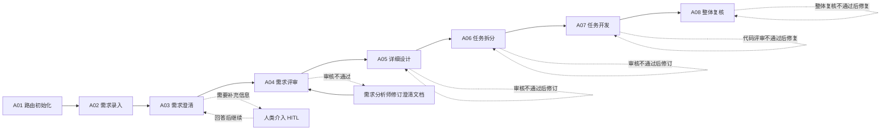
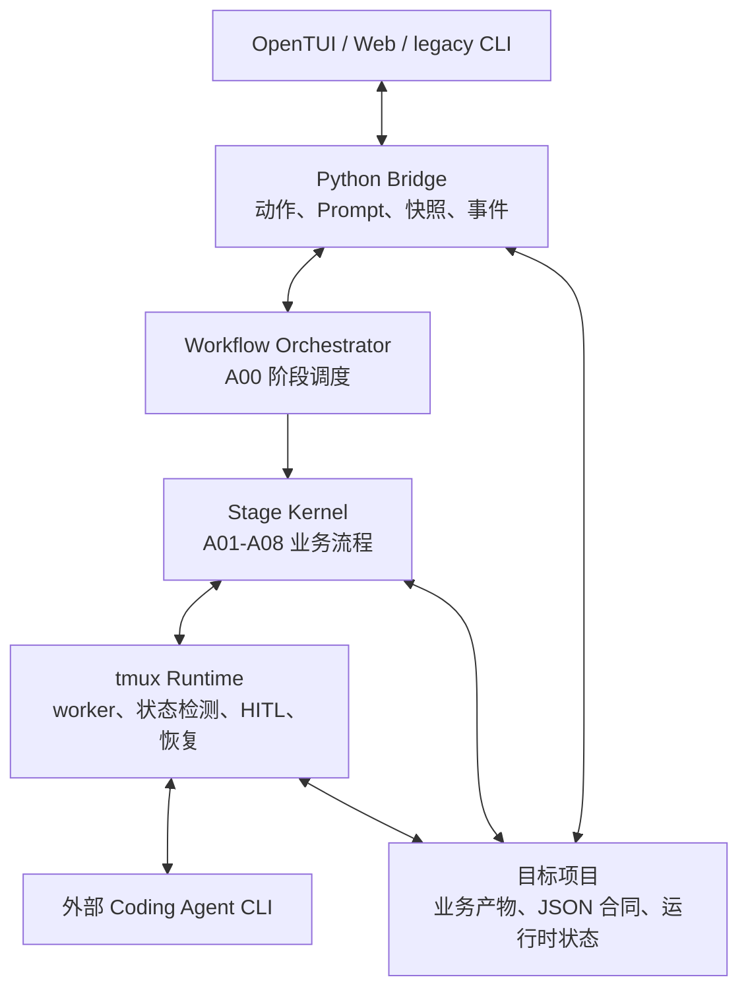

# TmuxCodingTeam 项目介绍

## 项目是什么

TmuxCodingTeam 是一个运行在本地的多智能体软件开发编排系统。

它把一个真实的软件需求拆成固定的工程流程，让不同 coding agent 分别承担需求分析、设计、任务拆分、开发和审核工作，并通过 tmux 长会话、结构化文件合同和人类介入机制，把各阶段连接成一条可观察、可审计、可恢复的流水线。

项目当前支持 Codex、Claude、Gemini、OpenCode、MiMo、Antigravity（`agy`）和 DevEco Code。不同阶段、主智能体和审核智能体可以使用不同厂商、模型、推理强度和代理配置。

这个文档用于帮助人类理解项目。智能体实际修改本仓库时，仍应先读取 `AGENTS.md`，并以 `docs/repo_map.json`、`docs/task_routes.json`、`docs/pitfalls.json` 作为机器路由入口；最终实现行为以代码和测试为准。

## 它解决什么问题

直接使用单个 coding agent 开发复杂需求时，常见问题包括：需求理解与实现脱节、设计未经独立审查、开发过程难以追踪、智能体中断后上下文丢失，以及“终端看起来完成了”但交付文件并不完整。

TmuxCodingTeam 用以下方式处理这些问题：

- 用 A01～A08 固定阶段组织从需求到整体复核的过程。
- 用主智能体负责生成或修改，用多个审核智能体从不同角色独立审查。
- 用 Markdown 和 JSON 产物承接阶段结果，而不是把聊天文本当作完成依据。
- 用 tmux 保存长期运行的智能体会话，允许查看现场、继续交互或重建 worker。
- 用 HITL（Human in the Loop）在需求不明确、登录授权、协议确认或运行异常时请求人类决策。
- 用 TUI、Web 和 legacy CLI 展示同一套后台状态与控制能力。

## 完整工作流程



### A01 路由初始化

系统先检查目标项目是否已有机器可读的项目路由层。缺失时，路由智能体分析项目并生成：

- `AGENTS.md`：智能体在目标项目中的工作协议。
- `docs/repo_map.json`：模块、文件、依赖关系和测试入口。
- `docs/task_routes.json`：不同任务应该读取哪些模块。
- `docs/pitfalls.json`：高风险修改和安全检查。

生成后会进入审核；审核不通过时，智能体根据审核记录修订并再次审核。已有完整路由层时可以跳过本阶段。

### A02 需求录入

系统确定项目目录和需求名称，并将文本、本地文件或 Notion 页面内容统一保存为：

```text
{需求名}_原始需求.md
```

已有原始需求也可以直接复用，避免重复录入。

### A03 需求澄清

需求分析师读取原始需求和项目路由层，补齐业务边界、约束、验收标准和默认假设，生成需求澄清文档。

如果存在无法安全推断的问题，系统通过 HITL 展示问题并等待人类回答；回答会写入交流记录，然后交给原需求分析师继续处理，而不是重新开始整个阶段。

### A04 需求评审

审核智能体独立检查需求澄清是否完整、可实现、可测试且没有越界。系统合并审核结果：

- 全部通过：进入详细设计。
- 存在问题：将反馈交回需求分析师修订，再开始下一轮审核。
- 达到最大审核轮次：进入关键 HITL，由人类补充决策后继续真实审核，不直接强制判定通过。

### A05 详细设计

需求分析师基于通过评审的需求和项目代码生成详细设计，明确代码落点、接口、数据流、兼容性、测试方案和风险。

开发工程师、测试工程师、架构师、审核员等角色可以并行评审。评审意见会反馈给需求分析师，形成“设计—审核—修订—再审核”的闭环。

### A06 任务拆分

系统把详细设计转换为可执行的任务单：

```text
{需求名}_任务单.md
{需求名}_任务单.json
```

Markdown 供人类和智能体阅读，JSON 是机器跟踪任务完成状态的事实来源。任务单同样必须经过审核和必要修订。

### A07 任务开发

开发工程师按任务单逐项实施。每个任务通常经历：

1. 开发工程师读取任务、路由层和相关文件。
2. 执行最小范围代码修改与自检。
3. 多个审核智能体从需求、测试、架构和契约角度评审。
4. 如未通过，将合并后的反馈交回开发工程师修复。
5. 文件合同验证成功后，更新任务单 JSON，再进入下一项任务。

智能体显示 `READY` 只代表终端可继续输入，不代表任务已经完成；只有结果文件、目标产物和状态合同都通过校验，系统才会确认这一轮成功。

### A08 整体复核

所有开发任务完成后，审核智能体对整体代码、需求覆盖、回归风险和最终产物做全局复核。未通过时，开发工程师根据合并意见修订，再进入下一轮复核。

当前主流程在 A08 完成后结束。独立的自动化测试阶段、提交代码和创建 PR 尚未接入 A00 主链路。

## 多智能体如何协作

系统采用“主智能体生成，审核智能体把关”的基本模型：

- 主智能体：负责需求澄清、详细设计、任务拆分或代码修改。
- 审核智能体：不直接替代主智能体完成任务，而是从指定角色视角给出通过或不通过结论。
- 反馈闭环：审核结果合并后交回主智能体，主智能体只针对有效问题做修订。
- 会话交接：相邻阶段可以复用仍然存活且配置兼容的 tmux worker，保留上下文。
- 配置隔离：不同角色可以选择不同 vendor、model、effort、proxy 和 Ponytail 模式。

Ponytail 在本项目中是可选的智能体行为模式，不是 coding agent 厂商。新工作流默认使用 Full，也可以选择 Lite、Ultra 或 Off；角色级配置可以覆盖工作流默认值。

## 系统架构



### 1. 入口与流程编排

- `A00_main_tui.py`：完整工作流入口；交互终端默认进入 OpenTUI。
- `A00_main_web.py`：同时启动本地 WebBackend 和 Web 前端。
- `tmux_core/workflow/entry.py`：A01～A08 的阶段切换、回退和参数传递。
- `A01_*.py`～`A08_*.py`：各阶段的直接运行入口，适合单阶段执行和调试。

### 2. 阶段内核与文件合同

`tmux_core/stage_kernel/` 实现各阶段的生成、审核、修订、HITL 和 worker 交接逻辑；`tmux_core/prompt_contracts/` 定义阶段输出必须满足的文件和状态合同。

系统不会仅凭终端出现“完成”或智能体回到 READY 就推进流程。它还会检查 result/status JSON、必需产物、文件哈希或任务状态，避免漏写文件、复用旧结果或误判完成。

### 3. tmux 智能体运行时

`tmux_core/runtime/` 负责：

- 发现本机已安装的 coding agent 及其可用模型。
- 生成不同厂商的启动命令和推理参数。
- 为每个角色创建独立 tmux 会话并投递任务。
- 识别 `STARTING`、`READY`、`BUSY`、`DEAD` 四种终端健康状态。
- 单独跟踪 turn 的 `preparing`、`submitted`、`waiting_result`、`succeeded`、`failed` 等生命周期。
- 处理 tmux 瞬态不可用、提交结果不确定、启动阻塞和人工恢复。

健康状态、任务状态和阶段状态彼此独立。例如，一个智能体可以是 `alive/READY`，但它对应的任务仍可能缺少结果合同，阶段不能因此自动完成。

### 4. Bridge 与用户界面

`tmux_core/bridge/` 是界面和 Python 工作流之间的统一桥接层，负责 action 分发、Prompt 请求、HITL、worker 快照、文件预览、日志和阶段事件。

- OpenTUI 使用 Bun、Solid 和 OpenTUI，通过 NDJSON stdio 与 Python 后端通信。
- Web 使用 Bun、Vite 和 Solid，通过本地 HTTP API 与 SSE 事件流通信。
- 两端消费相同的核心快照和阶段状态；Web 可以提供适合浏览器的额外展示能力，但工作流语义以统一后端为准。

### 5. 持久化状态

目标项目中既保存可交付文档，也保存可恢复运行时。常见目录包括：

```text
.routing_init_runtime/
.requirements_review_runtime/
.detailed_design_runtime/
.task_split_runtime/
.development_runtime/
.tmux_workflow/
```

worker state 记录单个智能体会话，turn result 记录单次任务结果，stage state/failure 记录阶段 runner 的权威终态。`runner_id` 和递增的 `stage_seq` 用于拒绝旧 runner 的迟到事件，避免旧状态覆盖新流程。

## 人类在流程中的作用

系统会自动执行可确认的工程步骤，但不会替人类做高风险决定。以下情况通常会暂停并请求输入：

- 原始需求缺少关键业务规则或验收口径。
- coding agent 要求登录、授权、接受协议或信任 Hook。
- 智能体会话异常，需要选择重新检查、重建或按死亡处理。
- 审核达到轮次上限，仍需要业务取舍或真实环境信息。
- 提示词是否成功提交无法确认，系统为避免重复执行而停止自动重发。

处理时可以通过界面提交回答，也可以使用界面给出的 `tmux attach -t <session>` 进入原会话查看现场。

## 主要产物

一次完整需求通常会在目标项目中留下：

| 阶段 | 主要产物 |
| --- | --- |
| 路由初始化 | `AGENTS.md`、`docs/repo_map.json`、`docs/task_routes.json`、`docs/pitfalls.json` |
| 需求录入 | `{需求名}_原始需求.md` |
| 需求澄清 | `{需求名}_需求澄清.md`、人机交流记录 |
| 需求评审 | `{需求名}_需求评审记录.md`、各审核者的 Markdown/JSON 结果 |
| 详细设计 | `{需求名}_详细设计.md`、`{需求名}_详设评审记录.md` |
| 任务拆分 | `{需求名}_任务单.md`、`{需求名}_任务单.json`、任务单评审记录 |
| 任务开发 | `{需求名}_工程师开发内容.md`、代码评审记录、更新后的任务状态 |
| 整体复核 | `{需求名}_整体代码复核记录.md`、`{需求名}_复核阶段状态.json` |

这些文件既是交付物，也是阶段之间的输入。不要在流程运行期间随意删除运行时目录或伪造完成状态。

## 如何启动

启动默认 OpenTUI 工作流：

```bash
python3 A00_main_tui.py
```

启动 Web 控制台：

```bash
python3 A00_main_web.py
```

使用 legacy Python CLI：

```bash
python3 A00_main_tui.py --no-tui --legacy-cli
```

也可以直接运行某个 `A01_*.py`～`A08_*.py` 阶段。完整安装、参数和配置示例见 `README.zh-CN.md`。

## 项目边界

- 本项目负责本地流程编排，不提供外部 coding agent 的账号、订阅、认证或网络服务。
- coding agent 的实际能力和可用模型取决于用户本机安装及外部服务状态。
- 目标项目代码由外部 agent 在用户授权范围内修改，TmuxCodingTeam 负责调度、合同校验和状态记录。
- 当前已实现的正式主链路是 A01～A08；A08 之后的测试、发布、提交和 PR 自动化仍需后续接入。

一句话概括：TmuxCodingTeam 把多个本地 coding agent 组织成一支有角色、有阶段、有审核、有证据、有人类兜底的软件工程团队。
